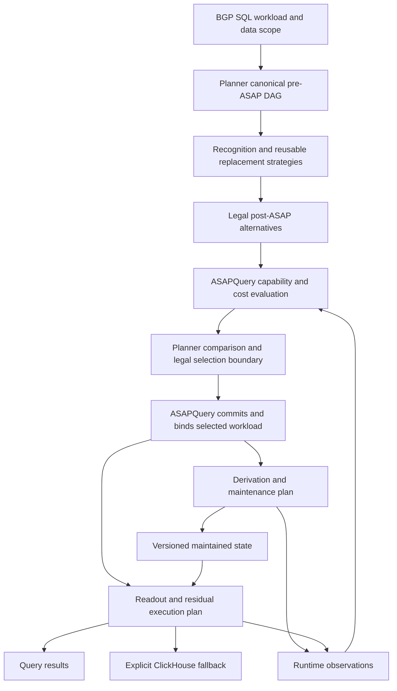
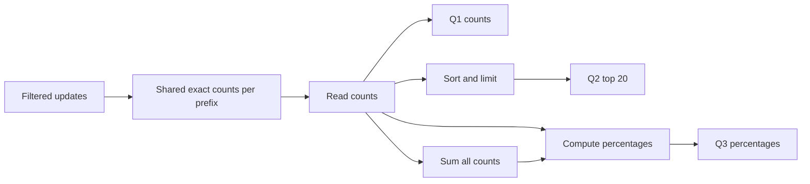

# BGP workload integration with ASAPPlanner

Status: proposed engineering integration plan. No integration work is claimed complete by this document.

Audience: ASAPQuery and ASAPPlanner developers and architecture reviewers.

## 1. Objective and scope

Integrate the BGP SQL workloads on `sql-normalizer-pattern-recognition` with ASAPPlanner while retaining ASAPQuery as the query engine and maintenance runtime. The selected post-ASAP workload DAG is the authoritative semantic plan. ASAPQuery compiles that decision into ingestion, state-maintenance, storage, and query-execution plans.

The integration must preserve the branch's query recognition and result semantics, expose reusable optimization opportunities to Planner, and demonstrate execution correctness and actual sharing. Parsing a query, recognizing a shape, or displaying a DAG does not establish that a workload can be accelerated correctly.

The initial scope is one ASAPQuery deployment with an exact ClickHouse comparison/fallback path. Distributed placement, a repository rename, and integration with DQC's executors are not prerequisites. DQC contributes shared requirements and potentially reusable Planner strategies; it is a separate downstream application.

This document owns the BGP migration and cross-repository delivery plan. Planner's shared IR, provider, and cost contracts remain documented in ASAPPlanner. Implemented changes should update those documents and link back here rather than create duplicate contract definitions.

## 2. Inspected baseline and references

The findings below are based on source inspection, not a fresh test or benchmark run. Pin these revisions for the initial audit; refresh the matrix explicitly as either repository advances.

| Source | Inspected revision / status | Relevance |
| --- | --- | --- |
| [ASAPQuery recognition branch](https://github.com/ProjectASAP/ASAPQuery/tree/1cd9a00ffaee1a3ca0ad7a751fd5c78181ec9895) | `1cd9a00ffaee1a3ca0ad7a751fd5c78181ec9895` | Recognition, registration, derivation, maintenance, and SQL serving baseline |
| [ASAPPlanner main](https://github.com/ProjectASAP/ASAPPlanner/tree/d0701dd4d4f0acb267b004c42ba30b2c9547ff7c) | `d0701dd4d4f0acb267b004c42ba30b2c9547ff7c` | IR, strategies, corpus, lifecycle/provider integration, and viewer baseline |
| [ASAPQuery-backend PR #512](https://github.com/ProjectASAP/ASAPQuery-backend/pull/512) | Open at inspection; head `45dd2e103b2e4886c765d781929b308ce4bb5fd8` | Proposed authoritative semantic DAG and derived physical-plan boundary |
| [DQC integration proposal](https://github.com/ProjectASAP/asap-fusion/blob/9d2ef48ca57a509248c7d6b694d534546b85a58f/docs/design/system/asapplanner-integration.md) | User-specified revision | Shared optimization, engine execution, materialization, and feedback responsibilities |
| [Planner PR #353](https://github.com/ProjectASAP/ASAPPlanner/pull/353) | Open at inspection | Physical-plan result/buffer cache evidence; not complete lifecycle cache integration |
| [Planner PR #339](https://github.com/ProjectASAP/ASAPPlanner/pull/339) | Merged at inspection | Analytical cost and benefit annotations in DAG viewer |

Primary implementation references:

- [SQL shape recognition design](SQL_SHAPE_RECOGNITION_DESIGN.md) and [capability matching design](CAPABILITY_MATCHING_DESIGN.md).
- [Shared pattern library](../asap-common/dependencies/rs/sql_utilities/src/ast_matching/pattern_rewrites.rs), [spatial predicate recognizers](../asap-common/dependencies/rs/sql_utilities/src/ast_matching/spatial_filter.rs), and [SQL registration generator](../asap-planner-rs/src/sql/generator.rs).
- [SQL serving](../asap-query-engine/src/engines/simple_engine/sql.rs), [computed labels](../asap-query-engine/src/precompute_engine/computed_labels.rs), [transition configuration](../asap-common/dependencies/rs/asap_types/src/stateful_transition.rs), and [transition runtime](../asap-query-engine/src/precompute_engine/stateful_transition.rs).
- Planner [pre-ASAP IR](https://github.com/ProjectASAP/ASAPPlanner/blob/d0701dd4d4f0acb267b004c42ba30b2c9547ff7c/crates/types/src/pre_asap/query_expr.rs), [post-ASAP IR](https://github.com/ProjectASAP/ASAPPlanner/blob/d0701dd4d4f0acb267b004c42ba30b2c9547ff7c/crates/types/src/post_asap/expr.rs), [strategy inventory](https://github.com/ProjectASAP/ASAPPlanner/blob/d0701dd4d4f0acb267b004c42ba30b2c9547ff7c/crates/asap-aware-mapping/src/lib.rs), and [downstream boundary](https://github.com/ProjectASAP/ASAPPlanner/blob/d0701dd4d4f0acb267b004c42ba30b2c9547ff7c/docs/design_docs/asapplanner-downstream-boundary.md).
- Planner [BGP corpus test](https://github.com/ProjectASAP/ASAPPlanner/blob/d0701dd4d4f0acb267b004c42ba30b2c9547ff7c/crates/frontend-sql/tests/bgp_jan2024_workload/bgp_jan2024_workload.rs) and [DAG viewer](https://github.com/ProjectASAP/ASAPPlanner/blob/d0701dd4d4f0acb267b004c42ba30b2c9547ff7c/tools/dag-viewer/README.md).

### 2.1 Existing functionality

- Planner already contains the 200-query BGP workload. Its fixture matches this branch's workload except for a trailing newline. The inspected test pins 151 lowered queries, 34 planning errors, seven not-implemented outcomes, six unsupported-feature outcomes, and two other errors. These are frontend expectations, not runtime coverage.
- Planner already has canonical CSE, shared-subtree alternatives, rollup, AVG decomposition, summary-family alternatives, and Hydra grouping. Lifecycle and provider-evidence machinery also exists.
- Pre-ASAP already represents projection, filtering, aggregation, joins, sorting, limits, and SQL window functions. A frontend or runtime gap does not automatically require a new IR node.
- Post-ASAP supports summary construction, merging, readout, selected summary operations, and a binary operation form. `KeepPreAsap` embeds an original query subtree; it is not a general exact relational operator accepting summary-node children.
- ASAPQuery recognizes and executes many complex shapes through shared recognizers, surrogate queries, generated configuration, and specialized serving branches. These are migration inputs and comparison baselines.
- Although the recognition design describes an AST-level pattern library, parts of `pattern_rewrites.rs` use string matching and extraction. Porting those helpers unchanged would not by itself establish semantic equivalence.

### 2.2 Confirmed gaps versus audits

Confirmed representation gaps in the inspected Planner baseline are explicit relational fanout and general exact relational composition over summary outputs. SQL function/indexing/interval/subquery coverage also has known corpus failures.

Ordered stateful derivation requires a contract audit: SQL window intent exists, but mapping it to incremental per-partition state must preserve ordering, frame, filtering, and initialization semantics. Multi-state fusion, complete residual support, workload selection, and runtime bindings require executable audits before claiming support or choosing their final API shape.

## 3. Target architecture and ownership



Planner proposes and compares semantically legal alternatives. ASAPQuery's control plane commits an executable workload choice and retains its provider binding. The exact composition of the existing PlanSpace and lifecycle selection APIs is an integration decision, not a claim that one current API already returns the entire executable workload.

| Concern | ASAPPlanner | ASAPQuery |
| --- | --- | --- |
| Query meaning | Canonical SQL semantics, equivalence, schemas, grouping, logical time scope | SQL endpoint, BGP catalog and source registration |
| Recognition and optimization | Reusable derivation/summary/residual rewrites and legality | Supported runtime implementations and capability evidence |
| State choices | Summary family/parameters, logical lifecycle, legal sharing and realization alternatives | State structures, encoding, retention layout, tasks, and recovery |
| Selection | Compare legal alternatives using scoped capability, cost, and accuracy evidence | Commit feasible deployment choice; bind concrete implementation |
| Identity | Logical producers, dependencies, query roots | Provider binding, aggregation IDs, materializations, active generation |
| Execution | Selected semantic contract | Ingestion, maintenance, scheduling, readout, exact residuals, fallback |
| Feedback | Consume comparable evidence for future planning | Measure cardinality, resource use, coverage, readiness, and failures |

Concrete storage handles, task IDs, connections, and placement remain downstream. The selected provider alternative identity accompanies the decision as binding/provenance metadata; it does not require embedding executor configuration in logical IR.

### 3.1 Mapping the recognition decomposition

| Stage | Shared semantic representation | Runtime realization |
| --- | --- | --- |
| `ρ(Q) -> (Q', π)` | Original query root, legal maintainable subexpression, explicit residual dependencies | Recognize/canonicalize incoming requests and locate validated installed bindings |
| `τ`: projection | Typed expressions for origin extraction, time bucketing, computed values | Computed-label/value implementation |
| `τ`: fanout | Relational expansion with output schema, ordering where relevant, and multiplicity | Token explosion and adjacent-edge emission |
| `τ`: stateful comparison | Ordered partition/window semantics and a validated incremental realization | Previous-value or previous-time state per partition |
| `γ`: maintenance | Selected exact/sketch state, grouping, update semantics, logical windows and lifecycle | Build, update, merge, retain, and recover state |
| `eval` | Typed summary readout | Bound state lookup, merge, and estimate/exact extraction |
| `π`: residual | Exact projection, filter, ranking, ratio, window, aggregation, or membership join over readouts | Supported ASAPQuery operators or a bound exact-engine subgraph |

The DAG must retain the source-to-derived-stream relationship. Registering an opaque derived table alone would conceal derivation cost and semantics from optimization and sharing checks.

Predicate enforceability is a candidate eligibility condition. Every predicate removed from query-time execution must be preserved by the derivation or ingest filter. Unsupported predicates require an exact alternative or explicit fallback, not partial filtering.

## 4. Workload coverage and semantic requirements

Create a machine-readable matrix keyed by original corpus query ID and additional branch regression IDs. Record source revision, SQL, catalog, time scope, accuracy target, recognized shape, required operators, lowering outcome, candidate outcome, provider outcome, runtime outcome, fallback reason, and fixture reference. Retain the aggregate tally as a regression signal, but add per-query expectations for the integration subset.

| Workload family | Planner direction | Required checks |
| --- | --- | --- |
| Counts, sums, distinct counts, quantiles | Existing aggregate/summary alternatives | Aggregate arguments, null behavior, exact versus approximate contract |
| Origin selection and computed grouping | Typed projection plus aggregate | Tokenization, malformed/empty paths, casts, aliases, and output types |
| ASN/community frequency and adjacent edges | Explicit expansion before aggregation | Repeated tokens, occurrence versus distinct semantics, edge direction, empty expansion |
| Path changes and inter-arrival gaps | Window intent with legal stateful realization | Partition, event order, frame, offset/default, initialization, and time scope |
| Multi-aggregate rows, ratios, percentages | Compatible state fusion and exact residual projection | Shared population, denominator, empty groups, and division semantics |
| HAVING, two-stage histograms, running totals | Exact operators consuming readouts | Threshold behavior, missing buckets, frame semantics, aggregate-of-aggregate legality |
| Bucketed top-N | Exact partitioned sort/limit initially | Complete candidate population, tie behavior, bucket scope |
| MOAS and membership queries | Exact distinct/set state and exact residual join initially | Membership is not cardinality; set/list output cannot be reconstructed from a count sketch |
| Raw history and unsupported shapes | Exact execution alternative | No forced summary conversion; explicit reason and correct result schema |

Corpus query titles are not semantic specifications. For example, q024/q025 request changed-row detail, whereas the branch's count-oriented lag-transition recognizer expects an outer aggregate. They must not be treated as the same supported shape simply because both mention path changes.

### 4.1 Stateful correctness gate

The inspected runtime stores the last value per partition and updates it in `process_row` arrival order. Before selecting this implementation for ordered SQL, establish or enforce:

1. Event-time ordering, deterministic ties where required, and behavior for late data.
2. Exact partition keys from the query; do not substitute a conventional BGP route key.
3. Whether filtering happens before or after the window function.
4. Whether the first row uses a predecessor within the SQL window, earlier retained history, or a SQL default.
5. Frame and lag-offset compatibility; only supported forms are eligible.
6. State continuity across input files, restart, replay, and duplicate input.
7. A bounded-state/retention policy that preserves the selected semantics.

Begin with a declared ordered-input profile. Other profiles remain unavailable until their implementation and evidence satisfy the same contract. Adding a last-value map does not prove generic SQL-window support.

Event-log aggregation and current routing-state maintenance are different workloads. A withdrawal counts as an event in one and may remove a route in the other; do not infer negative summary updates from the operation field without the query's semantics.

### 4.2 Time and accuracy gate

Check logical start/end inclusivity, bucket alignment, timezone, complete retained coverage, and state generation. Equal window durations alone do not prove coverage equivalence. Shape compatibility must be followed by runtime readiness validation.

Start with exact state. Approximate extensions must declare the error quantity and guarantee scope. Numeric count error does not establish correct `HAVING` membership, MOAS detection, or top-N identities. Ratios require a denominator policy and propagated guarantees; shared state does not imply independent errors. Observed error is feedback, not a certified bound.

## 5. ASAPPlanner implementation slices

The IDs below are proposed tracking IDs, not existing GitHub issues. Open issues for confirmed shared gaps after refreshing the baseline, link them here, and deliver PRs with the indicated acceptance behavior. Owners are repository roles; individual assignment is a team decision.

| ID / priority | Change and likely location | Dependencies | Acceptance |
| --- | --- | --- | --- |
| P1 / P0 | Corpus matrix and focused integration fixtures in `crates/frontend-sql/tests` and `crates/integration-tests` | None | Every initial query has explicit lowering/recognition/feasibility/execution outcomes; unsupported cases remain visible |
| P2 / P0 | Exact relational composition over post-ASAP inputs in `crates/types/src/post_asap` and mapping/export code; begin with projection, reduction, sort, limit | P1 fixtures | Summary outputs feed typed residual operators; shared children and all query roots survive traversal and serialization |
| P3 / P0 | ASAPQuery provider conformance through existing physical-alternative/lifecycle interfaces | P1; coordinate with A1/A2 | Reject unsupported whole alternatives; retain complete candidate evidence and stable binding identity; demonstrate how workload and lifecycle selection compose |
| P4 / P1 | ClickHouse frontend coverage in `crates/sql-function-catalog` and `crates/frontend-sql` | P1 | Close individually tracked function, indexing, interval, and subquery gaps with semantic fixtures; no support claim based solely on stub registration |
| P5 / P1 | Generic relational expansion in pre/post IR, schema derivation, binding, CSE, mapping, and export | P1, relevant P4 coverage | Preserve fanout multiplicity and output identity; provider executes token/edge fixtures correctly |
| P6 / P1 | Ordered stateful realization and legality checks using existing SQL-window intent where sufficient | P1, P3, A3 | Pass the stateful correctness gate; reject incompatible ordering/frame/history profiles |
| P7 / P1 | Extend state fusion, decomposition, and sharing rules in `crates/asap-aware-mapping` | P2, P3 | Initial multi-query example shares one producer; grouping, filters, windows, nulls, and guarantees constrain reuse |
| P8 / P1 | Complete BGP cost evidence integration; extend shared model only for facts existing interfaces cannot express | P3, A5 | Rank complete alternatives on the same horizon; include derivation/state/residual work and count shared work once |
| P9 / P2 | Remaining residual operators and advanced rules: exact joins/windows, nested aggregation, membership, and approximate guarantees | P2, P4, P7 | Each new family has positive/negative legality fixtures and exact or declared approximate result validation |
| P10 / P1–P2 | Corpus-to-viewer and runtime report linkage in devtools and `tools/dag-viewer` | Initial P1/P2; runtime evidence from A5 | Show complete selected graph, roots, shared consumers, rejection reasons, cost provenance, and observed producer reuse |

### 5.1 Reuse existing strategies deliberately

- Use canonical CSE and `SharedSubtreeStrategy` for equivalent inputs and producers. Canonical identity must include derivation semantics, not generated metric names.
- Extend existing rollup for compatible grouping levels. Fine-to-coarse distinct counts cannot generally be added because an item can occur in several fine groups.
- Reuse AVG decomposition, preserving the count of non-null aggregate inputs and empty-input behavior.
- Add compatible multi-state aggregate fusion where current rules cannot represent it; do not assume a single `SummaryAgg` already supports arbitrary fused state.
- Reuse summary-family and grouping alternatives only when the provider supports build, update, merge, and readout under the requested lifecycle.
- Begin ranking queries with exact counts and exact sorting. A heavy-hitter sketch is an alternative requiring its own result contract, not an unconditional implementation of `ORDER BY count DESC LIMIT N`.

Avoid BGP-named operators when general projection, expansion, ordered partition state, and relational residuals express the requirement. Keep BGP parsing implementations downstream while making the semantics needed for legality and costing visible.

## 6. ASAPQuery implementation slices

| ID | Change | Dependencies | Acceptance |
| --- | --- | --- | --- |
| A1 | Workload adapter: SQL, catalog, source identity, data/time scope, recurrence, accuracy, and horizon to Planner | P1 | Original query IDs and result roots survive planning; parameterized windows retain their meaning |
| A2 | Capability/provider adapter for derivation, summaries, exact residuals, sharing, and lifecycle | P3 | Capability checks cover the whole executable alternative; unsupported operations return structured reasons |
| A3 | Physical compiler/binder from selected semantics to ingest, maintenance, storage, and serving projections | P2, A1, A2 | One binding maps logical producer to state/configuration/generation; projections agree on schema, windows, and parameters |
| A4 | DAG execution and activation: schedule shared producers, execute residuals, validate readiness, and fall back | A3 | Producers are maintained once per selected scope; every root returns; failed activation preserves the prior active configuration |
| A5 | Measurement and feedback keyed by semantic producer, provider alternative, and generation | A3/A4 | Comparable measured resource/cardinality reports feed future cost evidence; unknown or stale data cannot justify selection |
| A6 | Migrate recognition/serving paths by shape family and retire duplicate semantic selection | Per-family parity through A4 | Incoming queries execute validated installed bindings; unsupported or newly encountered semantic choices return to planning or exact fallback |

Existing recognizers and specialized serving branches remain comparison baselines during migration. Share canonical recognition semantics between workload registration and incoming queries. Do not let one path choose a new summary family, grouping, logical window, or lifecycle independently of the committed plan.

For ad-hoc SQL, distinguish locating an already installed compatible binding from choosing a new plan. Legal reuse may serve an existing state only after semantic, accuracy, generation, and coverage checks. If a new choice is needed, request planning or use the configured exact route.

An exact engine may execute a supported residual subgraph. Its binding must consume the selected intermediate data and preserve shared producer boundaries; regenerating a raw-source query independently for every root would defeat the selected plan.

## 7. Capability, cost, and feedback contract

Reuse existing interfaces before adding new public abstractions. The BGP adapter must provide, directly or through existing structures, the following information:

| Evidence | Required content |
| --- | --- |
| Comparison scope | Source and snapshot/stream identity, filters, derivation semantics, event-time scope, recurrence, horizon, exact/approximate objective |
| Capabilities | Supported expression/expansion/window semantics; state family/parameters; build/update/merge/readout; residual operators; retained sharing; ordering and recovery profile |
| Cardinality | Input rows/rate, filtered rows, token and edge fanout, emitted transitions/gaps, groups, distinct items, active state partitions, residual row counts |
| Resource costs | Bootstrap/decode/filter/derive CPU; update CPU; previous-value and summary memory; retained windows; source reads; materialization writes/reads; merge and residual work; spill if applicable |
| Provenance | Model/calibration version, evidence generation, provider alternative identity, selected semantic producer, scope and units |
| Runtime state | Coverage/watermark, completeness, active generation, compatible state schema, failures and fallback reason |

Compare raw recomputation, prepared state, and continuous maintenance only where supported. Over a common horizon, account for bootstrap, arrivals and fanout, retained state, repeated reads, residual work, and shared producers once. Include expected fallback work if the deployment model assumes fallback during warm-up or unavailable coverage.

PR #353 is related cache work, not a prerequisite for the first exact milestone. Its inspected description limits it to physical-plan cache evidence and leaves the summary-maintenance lifecycle adapter on a no-cache estimator. Use an explicit no-cache baseline until compatible cache evidence is available for both alternatives. Do not reuse physical-plan cache discounts in lifecycle comparisons without integrating their scope and provenance.

Report measured CPU time and bytes separately from analytical operation counts. Do not label an estimate as measured or infer runtime savings from fewer DAG nodes. Missing evidence remains unavailable rather than zero.

## 8. First end-to-end milestone

Use three synthetic integration queries over the same closed source interval and filter. These supplement the corpus and deliberately avoid fanout and stateful ordering in the first milestone.

```sql
-- Q1: exact update counts per prefix
SELECT prefix, COUNT(*) AS n
FROM bgp.bgp_updates
WHERE collector = 'rrc00'
  AND timestamp >= '2024-01-08 00:00:00'
  AND timestamp <  '2024-01-08 01:00:00'
GROUP BY prefix;

-- Q2: top prefixes; prefix provides a deterministic tie-break
SELECT prefix, COUNT(*) AS n
FROM bgp.bgp_updates
WHERE collector = 'rrc00'
  AND timestamp >= '2024-01-08 00:00:00'
  AND timestamp <  '2024-01-08 01:00:00'
GROUP BY prefix
ORDER BY n DESC, prefix ASC
LIMIT 20;

-- Q3: percentage of all updates in the selected population
SELECT prefix, n, 100.0 * n / SUM(n) OVER () AS pct
FROM (
  SELECT prefix, COUNT(*) AS n
  FROM bgp.bgp_updates
  WHERE collector = 'rrc00'
    AND timestamp >= '2024-01-08 00:00:00'
    AND timestamp <  '2024-01-08 01:00:00'
  GROUP BY prefix
);
```

The desired alternative has one maintained exact count producer. Q3 may be represented by an exact window over the readout or a legal total-reduction plus projection/join decomposition. Its lowering and post-ASAP representation are milestone work, not assumed existing support.



Acceptance:

- Exact counts and selected top rows match ClickHouse; percentage comparison follows the agreed numeric type/rounding policy.
- All three query roots remain visible with stable producer references after compilation and activation.
- Runtime instrumentation verifies one maintained count producer per compatible source/window/generation, reused across roots and repeated requests.
- Equal-count ties, empty input, time-boundary rows, missing coverage, and failed activation have explicit tests.
- A workload profile with complete cost evidence can select the shared alternative; a profile where maintenance is not worthwhile can retain exact recomputation.
- Viewer output and runtime observations refer to the same selected plan. Graph identity alone is not evidence that a producer executed once.

Then add one token-fanout workload, one transition/gap workload with ordered input, and advanced residual families. Each is a separate acceptance gate.

## 9. Delivery order and validation

| Stage | Delivery | Exit gate |
| --- | --- | --- |
| 0. Freeze audit | P1; refresh revision/gap matrix and agree on boundary questions | Per-query scope and confirmed issues are recorded |
| 1. Exact vertical slice | Initial P2/P3/P7, A1–A4, initial P10 | Three-query milestone has result parity, preserved bindings, actual sharing, and explicit fallback |
| 2. Cost-based execution choice | P8 and A5; expand lifecycle coverage | Complete comparable evidence selects feasible alternatives and attributes observed work |
| 3. BGP derivation | Relevant P4, P5, P6 and A3 extensions | Fanout and ordered-state gates pass, including negative cases |
| 4. Broader workload semantics | P9 and remaining frontend/fusion work | Each supported family has execution and accuracy evidence |
| 5. Consolidate | A6 and full P10 reporting | Migrated families have one authoritative semantic selection path; remaining unsupported scope is explicit |

Use three levels of validation:

1. Planner conformance: lowering, schemas, legal/illegal rewrites, sharing identity, candidate feasibility, and complete cost comparison.
2. Cross-boundary conformance: selected semantics survive serialization/binding, unsupported nodes are rejected, and all execution projections agree.
3. Runtime differential tests: a deterministic BGP fixture executes through ingestion, maintenance, serving, and exact ClickHouse comparison; measure producer execution/update counts and coverage.

Keep negative cases for unsupported predicates, incompatible filters/windows, reordered events, incomplete state, stale evidence, and unsupported sketch operations. Prefer focused fixtures with known answers over asserting only that a pipeline returns successfully.

Extend the existing DAG viewer instead of building a separate BGP viewer. Add corpus selection, per-query outcome/rejection detail, shared-consumer counts, logical-to-runtime producer references, and estimated/measured cost provenance. The viewer's complete pre/post graphs and analytical annotations already provide the foundation.

## 10. Interface decisions to converge with the Planner team

Resolve the following with small executable examples and record the outcome in the owning repository's contract documentation:

| Decision | Proposed starting point | Why it must be explicit |
| --- | --- | --- |
| Exact post-ASAP composition | Add typed exact operators accepting post-ASAP children, beginning with the milestone subset | DQC and BGP both require residuals over shared summary outputs |
| Expansion representation | Generic relational expansion with typed expressions and multiplicity | Enables legality, cardinality, CSE, and costing without BGP executor code in Planner |
| Ordered state realization | Preserve SQL window intent and admit only capability-backed incremental rewrites | Arrival-order previous-value state is not universally equivalent to SQL order/frame semantics |
| Selection and commitment | Compose existing workload alternatives and lifecycle/provider selection; downstream commits the legal feasible choice | Avoid duplicate optimization and an implied nonexistent all-in-one API |
| Binding identity | Logical identity in DAG; concrete implementation and generation in downstream binding metadata | Reconcile provider selection provenance with deployment-independent IR |
| Ad-hoc requests | Validate reuse of installed plans; new semantic choices re-enter planning or fall back | Preserve useful capability matching without independent serving-time optimization |
| Approximate residuals | Exact first; add explicit guarantees per advanced family | Count error alone cannot certify membership, threshold, or ranking results |
| Corpus ownership | Planner owns semantic fixtures; ASAPQuery owns executable BGP/runtime fixtures, linked by stable query IDs | Keep frontend coverage distinct from end-to-end workload support |

This plan is ready to break into linked repository issues after the baseline refresh. Implementation completion requires the exit gates above; documentation agreement, frontend lowering, and a rendered DAG are intermediate evidence only.
