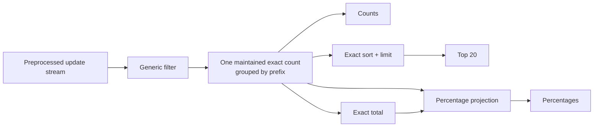

# BGP workload integration with ASAPPlanner

Status: proposed engineering plan. No integration work is claimed complete by this document.

Audience: ASAPAdapters, BGP preprocessing, ASAPPlanner, ASAPQuery, and architecture reviewers.

## 1. Decision

The BGP MVP uses a fixed preprocessing boundary implemented as a BGP adapter in
[ASAPAdapters](https://github.com/ProjectASAP/ASAPAdapters). The adapter has two coordinated
halves:

- a **data adapter** converts raw MRT/BGP records into stable relational tables before ASAP
  planning and summary maintenance; and
- a **query adapter** rewrites the corresponding original BGP SQL to target those tables and
  replaces known complex CTEs, macros, and subqueries with registered UDF calls.

The rewritten queries submitted to ASAP use ordinary physical columns and a small, versioned UDF
surface. Those UDFs are an adapter boundary: the MVP may expand them to normalized SQL, while a
later Planner integration may map the same functions directly to ASAP primitives.

ASAPPlanner does **not**:

- parse or execute BGP-specific string/array expressions such as `splitByChar`, `arrayJoin`, `arrayZip`, or `arraySlice`;
- model AS-path parsing, path expansion, route-state transitions, or inter-arrival gaps;
- produce a transformation plan or configure the preprocessing pipeline; or
- know how a preprocessed column was derived from an MRT record.

ASAPQuery does not independently recover those transformations from the original SQL. It consumes Planner's generic maintenance/readout plan and maintains counters, sketches, sets, and exact aggregates over the already-preprocessed stream.

ClickHouse retains the raw and preprocessed data and is the exact comparison/fallback engine. ASAPCollector integration is explicitly outside the MVP.

This replaces the earlier proposal in this document, which made derivation (`tau`) part of the Planner-to-ASAPQuery contract.

## 2. Target architecture

```mermaid
flowchart LR
    MRT[Public MRT/BGP stream]

    subgraph Adapters[ASAPAdapters: BGP adapter]
      subgraph Prep[Data preprocessing]
        Decode[MRT decode and schema normalization]
        Derive[Derive ordinary columns<br/>origin ASN, path length, prefix length]
        Expand[Produce ordinary event tables<br/>path hops and AS edges]
        Stateful[Produce stateful event columns/tables<br/>route transitions and arrival gaps]
        Decode --> Derive
        Derive --> Expand
        Derive --> Stateful
      end
      subgraph QueryPrep[Query preprocessing]
        Rewrite[Parse and rewrite source SQL]
        UDF[Replace known CTE/macro/subquery<br/>patterns with versioned UDFs]
        Rewrite --> UDF
      end
    end

    subgraph Data[Relational data boundary]
        Enriched[bgp_updates_enriched]
        Hops[bgp_path_hops]
        Edges[bgp_path_edges]
        Events[bgp_route_events]
        CH[(ClickHouse raw + preprocessed tables)]
    end

    subgraph Planner[ASAPPlanner]
        SQL[Generic SQL parser and lowering]
        Rho[Generic query-shape recognition]
        Select[Summary/share/cost selection]
        Plan[Generic maintenance and readout plan]
        SQL --> Rho --> Select --> Plan
    end

    subgraph Runtime[ASAPQuery]
        Register[Validate and register plan]
        Maintain[Maintain counter/sketch/set/aggregate]
        Store[(Windowed summary state)]
        Read[Readout and generic residual operators]
        Register --> Maintain --> Store --> Read
    end

    MRT --> Decode
    Derive --> Enriched
    Expand --> Hops
    Expand --> Edges
    Stateful --> Events
    Enriched --> CH
    Hops --> CH
    Edges --> CH
    Events --> CH

    OriginalQuery[Original BGP SQL] --> Rewrite
    UDF --> Query[Normalized SQL over<br/>preprocessed schema]
    Query --> SQL
    Plan --> Register
    Enriched --> Maintain
    Hops --> Maintain
    Edges --> Maintain
    Events --> Maintain
    Query --> Read
    Read --> Result[Query result]
    Read -. unsupported, unavailable, or incomplete .-> CH
    CH -. exact result .-> Result
```



The boxes are responsibility boundaries, not necessarily separate deployed services. The BGP data
adapter may be a standalone process or a fixed ClickHouse/streaming pipeline, and the query adapter
may run offline when preparing a workload or inline before planning. Their implementation and
deployment mechanisms are not encoded in Planner IR.

## 3. Component responsibilities

| Component | Owns | Does not own |
| --- | --- | --- |
| ASAPAdapters BGP data adapter | MRT decoding; schema normalization and cleaning; AS-path parsing; derived values; hop/edge fanout; ordered transition/gap computation; publication of stable relational tables | Query-shape recognition, summary selection, query serving |
| ASAPAdapters BGP query adapter | Source-to-target table/column rewrites; CTE/macro/subquery recognition; replacement with versioned UDFs; rewrite diagnostics and fallback classification | Summary selection, silently changing query semantics, executing unsupported rewrites |
| Adapter UDF catalog | Stable function names, typed signatures, semantic version, reference SQL implementation, and future ASAP-primitive mapping metadata | Choosing physical summaries |
| Preprocessed schema/catalog | Names, types, nullability, event-time column, table semantics, versioning, and data-quality contract | Transformation planning |
| ASAPPlanner SQL frontend | Generic SQL parsing/lowering over registered physical tables and columns | BGP string/array functions and MRT semantics |
| ASAPPlanner optimizer | Generic `rho`: filters, grouping, aggregates, top-k, distinct count, sharing, windows, lifecycle, cost, and legal residuals | Producing or placing BGP transformations |
| ASAPQuery | Plan validation/registration; streaming summary maintenance; windowed storage; generic readout and residual execution; readiness checks | Parsing raw AS paths or deciding preprocessing work |
| ClickHouse | Raw/preprocessed storage, exact differential oracle, and explicit fallback | ASAP summary selection |
| ASAPCollector | Possible future host/transport for preprocessing or summaries | MVP delivery |

The critical API is a versioned **adapter contract** pairing the preprocessed schema with its query
rewrite rules and UDF catalog, plus the generic Planner/runtime plan contract. There is no
transformation-plan API between Planner and the data adapter.

## 4. Preprocessing contract

The MVP must publish a versioned catalog whose columns have stable semantics. A proposed minimum is:

| Table | Important columns | Purpose |
| --- | --- | --- |
| `bgp_updates_enriched` | `timestamp`, `collector`, `peer_ip`, `peer_asn`, `prefix`, `operation`, `origin_asn`, `path_length`, `prefix_length`, `community_count` | One normalized row per BGP update, including commonly derived scalar values |
| `bgp_path_hops` | update identity/time/filter columns, `asn`, `hop_position` | One row per AS-path hop |
| `bgp_path_edges` | update identity/time/filter columns, `src_asn`, `dst_asn`, `edge_position` | One row per directed adjacent AS pair |
| `bgp_route_events` | route/peer identity, event time, `origin_changed`, `path_changed`, `interarrival_gap_seconds` | Precomputed ordered/stateful events |

Before implementation, pin the following semantics:

1. Stable update identity and deduplication/replay behavior.
2. Event-time ordering, tie handling, late data, and watermark policy.
3. AS-set/confederation/malformed-path tokenization and empty values.
4. Occurrence versus distinct semantics for hop and edge tables.
5. Transition partition keys, initialization, withdrawal behavior, and continuity across MRT files/restarts.
6. Timestamp timezone/unit and interval inclusivity.
7. Schema version and compatibility behavior.

Preprocessing may materialize more columns/tables later, but adding one does not require a new Planner operator. It requires catalog registration and ordinary SQL fixtures.

## 5. Query contract

ASAP accepts normalized SQL over the preprocessed schema. For example:

```sql
SELECT origin_asn, COUNT(*) AS announcements
FROM bgp.bgp_updates_enriched
WHERE collector = 'rrc00' AND operation = 'A'
  AND timestamp >= '2024-01-12 00:00:00'
  AND timestamp <  '2024-01-13 00:00:00'
GROUP BY origin_asn
ORDER BY announcements DESC
LIMIT 20;
```

ASAP is not required to accept the equivalent raw expression:

```sql
SELECT splitByChar(' ', as_path)[-1] AS origin_asn, COUNT(*)
FROM bgp.bgp_updates
GROUP BY origin_asn;
```

Likewise, hop and edge queries target `bgp_path_hops` and `bgp_path_edges`; transition and gap
queries target `bgp_route_events`. The ASAPAdapters BGP query adapter rewrites the original
BGPQueryBench SQL before submission. It must operate on a parsed SQL AST, preserve parameters and
aliases, be idempotent, and either produce a semantically equivalent query or return an explicit
unsupported reason so the original query can be sent to ClickHouse.

In particular, replace the workload's hairy AS-edge extraction subquery—the nested
`splitByChar`/`arraySlice`/`arrayZip`/`arrayJoin` expression—with a named, versioned UDF such as
`asap_bgp_path_edges(as_path)`. The query adapter can then lower that table-valued call to
`bgp_path_edges` for the preprocessed schema:

```sql
-- Adapter-facing normalized form
SELECT edge.src_asn, edge.dst_asn, COUNT(*) AS n
FROM bgp.bgp_updates AS u
CROSS JOIN asap_bgp_path_edges(u.as_path) AS edge
GROUP BY edge.src_asn, edge.dst_asn;

-- Data-adapted form submitted for the MVP
SELECT src_asn, dst_asn, COUNT(*) AS n
FROM bgp.bgp_path_edges
GROUP BY src_asn, dst_asn;
```

The function contract must define malformed/empty paths, AS sets and confederations, duplicate
hops, output ordering, and null behavior. Keep the function name and signature stable so a later
Planner rule can map it to one or more ASAP primitives without changing user queries. Apply the
same pattern only where semantics are pinned—for example scalar `asap_bgp_origin_asn(as_path)`—and
do not hide arbitrary unsupported SQL behind opaque UDFs.

## 6. Required generic Planner capability

Preprocessing removes BGP-specific expression support, but it does not remove the need for generic query planning.

| Shape | Planner/runtime direction |
| --- | --- |
| Filtered scalar/grouped count and sum | Exact mergeable accumulator; approximate frequency alternative when requested |
| `ORDER BY count DESC LIMIT k` | Exact sort/limit first; heap-bearing sketch only under an explicit approximate contract |
| `COUNT(DISTINCT col)` / `uniq` normalized upstream | Exact set or supported cardinality sketch |
| Multiple aggregates with the same population | Independent/fused state with typed per-key readout |
| AVG | Sum plus non-null count and read-time division |
| HAVING | Exact residual over maintained values; approximation requires a threshold-membership guarantee |
| Ratios and percentages | Maintain operands and apply typed read-time arithmetic |
| Two-stage histogram/running total/top-N per bucket | Generic exact residual operators over summary readouts |
| Set-membership queries | Exact member-producing state and residual semi/anti join, not cardinality-only state |
| Time windows | Bucket alignment, merge, complete coverage, watermark/readiness, and retention semantics |
| Unsupported shapes | Explicit ClickHouse fallback; never silently approximate or return empty/zero |

Avoid BGP-named Planner rules. A count grouped by `origin_asn`, `asn`, or `(src_asn, dst_asn)` is the same generic grouped-count shape as any other physical columns.

## 7. Implementation plan

### Phase 0 — freeze the boundary

- Define the BGP adapter manifest in ASAPAdapters, pairing input schema, output schema version,
  data transforms, query rewrite rules, and UDF signatures.
- Agree on the versioned preprocessed schema and sample rows.
- Inventory every BGPQueryBench data expression and query construct as `materialize`, `rewrite to
  column/table`, `replace with UDF`, `pass through`, or `unsupported/fallback`.
- Pin the hairy AS-edge subquery's semantics and replace it with the versioned
  `asap_bgp_path_edges` UDF boundary.
- Record exact ClickHouse equivalents for every MVP query.
- Pin one deterministic MRT fixture and its expected enriched/hop/edge/event rows.

Exit gate: the BGP data and query adapters pass golden tests; every MVP query has a deterministic
rewrite or explicit fallback reason; Planner and ASAPQuery fixtures contain no raw BGP-specific
string/array/stateful expression.

### Phase 0a — implement the BGP adapter in ASAPAdapters

- Implement batch/stream entry points for the data adapter and publish the four versioned tables.
- Implement AST-based query preprocessing with table/column rewrites, UDF replacement, rewrite
  diagnostics, and idempotence tests.
- Ship the UDF catalog and reference ClickHouse definitions/expansions beside the adapter.
- Add a paired golden corpus: raw records to preprocessed rows and original SQL to rewritten SQL.
- Expose a CLI/library interface that accepts an adapter name and contract version; do not couple
  ASAPQuery or ASAPPlanner to BGP implementation modules.

### Phase 1 — generic exact vertical slice

Implement three queries over `bgp_updates_enriched`, sharing one exact per-prefix count producer:

```sql
SELECT prefix, COUNT(*) AS n
FROM bgp.bgp_updates_enriched
WHERE collector = 'rrc00' AND timestamp >= :t0 AND timestamp < :t1
GROUP BY prefix;

SELECT prefix, COUNT(*) AS n
FROM bgp.bgp_updates_enriched
WHERE collector = 'rrc00' AND timestamp >= :t0 AND timestamp < :t1
GROUP BY prefix
ORDER BY n DESC, prefix ASC
LIMIT 20;

SELECT prefix, n, 100.0 * n / SUM(n) OVER () AS pct
FROM (
  SELECT prefix, COUNT(*) AS n
  FROM bgp.bgp_updates_enriched
  WHERE collector = 'rrc00' AND timestamp >= :t0 AND timestamp < :t1
  GROUP BY prefix
);
```



Acceptance:

- Results match ClickHouse for normal, empty, tied-count, and boundary-timestamp fixtures.
- Runtime evidence shows one compatible producer, not three independently maintained copies.
- Missing coverage, stale state, and failed activation trigger explicit failure/fallback.
- Planner IR and runtime plan contain no derived-column transformation.

### Phase 2 — scalar-derived columns and fanout tables

- Add origin-AS/path-length queries over `bgp_updates_enriched`.
- Add hop-frequency queries over `bgp_path_hops`.
- Add edge-frequency queries over `bgp_path_edges`.
- Validate occurrence multiplicity and filters against ClickHouse.

No Planner or ASAPQuery string/array execution is introduced in this phase.

### Phase 3 — distinct and multi-aggregate families

- Add exact distinct/member state and then capability-backed HLL/Theta/KMV alternatives.
- Add multi-aggregate, AVG, HAVING, ratio, and percentage readouts.
- Reject plans when the runtime cannot build, merge, or read the selected family; never substitute another accumulator.

### Phase 4 — preprocessed stateful events

- Add transition and inter-arrival-gap queries over `bgp_route_events`.
- Differentially validate preprocessor output across MRT file boundaries, restart/replay, late input, and ties.
- Keep SQL window-function parsing and incremental LAG realization outside Planner/ASAPQuery MVP scope.

### Phase 5 — broader generic composition and costing

- Add two-stage histograms, bucketed top-N, running totals, and exact membership joins.
- Compare exact recomputation, exact continuous maintenance, and legal approximate alternatives over the same horizon.
- Feed measured update/readout/state/cardinality evidence to Planner without exposing preprocessing implementation details.

## 8. Repository work split

### ASAPPlanner

- Register the preprocessed catalog and add normalized BGP SQL fixtures.
- Reuse/extend generic aggregate, sharing, residual, window, lifecycle, and cost rules.
- Preserve all query roots and selected producer identity across serialization.
- Keep raw BGP string/array/fanout/stateful functions out of the required frontend scope.

### ASAPQuery

- Accept and validate Planner's generic plan.
- Bind supported exact/sketch/set accumulators and generic residual operators.
- Maintain state over preprocessed input tables with coverage/readiness checks.
- Serve normalized SQL and route unsupported/unavailable queries to ClickHouse.
- Emit runtime evidence keyed by plan, producer, materialization, and generation.

### ASAPAdapters

- Implement the BGP data and query adapters and validate their paired, versioned contract
  independently of Planner.
- Publish preprocessed rows both to ClickHouse and the ASAPQuery ingest path.
- Own all raw BGP derivation, fanout, ordering, and state continuity behavior.
- Rewrite original BGP queries to the preprocessed schema; replace the hairy AS-edge subquery and
  other approved constructs with stable UDFs; report unsupported rewrites explicitly.
- Maintain reference UDF implementations plus mapping metadata for future lowering to ASAP
  primitives.

### Future ASAPCollector integration

ASAPCollector may later host preprocessing, transport preprocessed observations, or produce summaries. That must preserve the same schema and maintenance contracts. It is not a dependency or acceptance criterion for this MVP.

## 9. Validation and reporting

Use four layers of evidence:

1. Data-adapter differential tests: raw MRT fixture to expected preprocessed rows/tables.
2. Query-adapter golden and metamorphic tests: original SQL to expected normalized SQL, rewrite
   idempotence, and original-versus-rewritten ClickHouse results.
3. Planner conformance: normalized SQL lowering, legal/illegal generic rewrites, sharing identity, candidate feasibility, and serialization.
4. Runtime differential tests: preprocessed stream through summary maintenance/readout compared with exact ClickHouse results.

Maintain a machine-readable matrix keyed by query ID with normalized SQL, source table/schema version, time scope, accuracy target, Planner outcome, runtime outcome, and fallback reason. Report parsing/lowering separately from acceleration and executed correctness.

The DAG viewer should show the generic query and summary DAG, all roots, shared consumers, rejection reasons, and estimated/measured evidence. It should not display or imply a Planner-produced BGP transformation DAG.

## 10. Non-goals

- Supporting the original BGPQueryBench string/array/window SQL directly in ASAPPlanner or
  ASAPQuery (ASAPAdapters performs the supported preprocessing).
- Generating, optimizing, or dynamically deploying preprocessing transformations from Planner.
- Modeling MRT or AS-path semantics in Planner IR.
- Replacing ClickHouse as raw storage and exact fallback.
- ASAPCollector integration in the MVP.
- Claiming all 22 taxonomy families are accelerated because preprocessing can represent their inputs.

The MVP is complete when normalized queries over the fixed preprocessed schema are planned with generic ASAP rules, maintained and served by ASAPQuery, and differentially validated against ClickHouse, with unsupported cases falling back explicitly.
