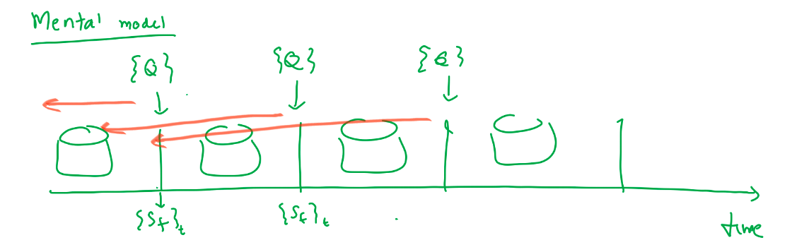

# Simplified formulation of the optimization formulation

## Mental model

Given a workload of repeating queries over time-series data, we want to map the query workload to an ensemble of summarization strategies to deploy.
Each query performs a certain aggregation over a certain time range over a given metric.
Each summarization strategy takes an input stream of metrics and computes summaries (exact or approximate) on it in a streaming manner. When queries are received, they are mapped to specific summaries, and answered using them (either directly from a single summary or by manipulating summaries such as merging them)

## Simplifying assumptions

- Data arrives at a regular `data_ingestion_interval`. E.g. for Prometheus, this will be the Prometheus scrape interval
- Each query repeats at the same time interval $T_r$.
- $T_r$ is a multiple of `data_ingestion_interval`

## Inputs

| Symbol | Source | Definition |
|--------|--------|-----------|
| $R = \{r_1, \ldots, r_n\}$ | User-specified | Set of RQEs (Repeating Query Expressions) |
| $T_r$ | User-specified | Time interval between repetition of each Query Expression |
| $\varepsilon_r$ | User-specified | Accuracy tolerance for RQE $r$ |
| $\text{SLA}_r$ | User-specified | Latency requirement for RQE $r$ |
| $S = \{s_1, \ldots s_n\}$ | Expert-defined | Set of summarization strategies |
| `ingest_cost(s)` | Expert-defined | Cost of ingesting data into a summary $s$ |
| `query_cost(s, r)` | Expert-defined | Cost of answering RQE $r$ from summary $s$ |

## Internal Variables

| Symbol | Derived from | Definition |
|--------|-------------|-----------|
| $f_r$ | Query workload | $1/T_r$ — query rate for RQE $r$ (queries/sec) |

## Outputs

| Symbol | Definition |
|--------|-----------|
| $y_s \in \{0,1\}$ | 1 if summarization strategy $s$ is deployed. |
| $x_{r,s} \in \{0,1\}$ | 1 if RQE $r$ is served by strategy $s$. |

## Objective

$$\min \sum_{s \in S} y_s \cdot \text{ingest\_cost}(s) \ + \ \sum_{r \in R,\ s \in S} x_{r,s} \cdot f_r \cdot \text{query\_cost}(s, r)$$

Both terms are cost rates (cost/sec). $f_r$ converts the per-query `query_cost` into a rate commensurate with the continuously-accruing `ingest_cost`.

## Constraints

$$\sum_{s \in S} x_{r,s} = 1 \qquad \forall r \in R \tag{1}$$

$$x_{r,s} \leq y_s \qquad \forall r \in R,\ s \in S \tag{2}$$

$$x_{r,s},\ y_s \in \{0,1\} \tag{3}$$

**(1)** Every RQE is served by exactly one strategy. **(2)** An RQE cannot be served by a strategy that is not deployed. **(3)** Integrality.

## Challenges

1. How to define the set of available summarization strategies $S$?
2. How to infer if a particular RQE $r$ can be feasibly answered using a summarization strategy $s$?
3. How to efficiently infer `ingest_cost` and `query_cost`, for different summarization strategies, queries, and data shapes/distributions?
