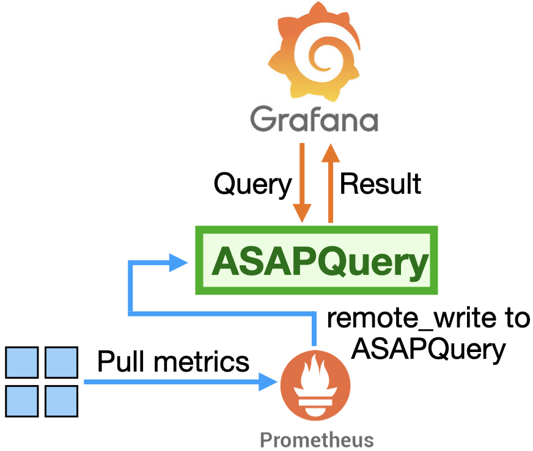

# ASAPQuery

**ASAPQuery** is a drop-in query accelerator for queries in various languages like PromQL and SQL. ASAPQuery delivers:
- **100x latency reduction** for various complex aggregate queries such as quantiles
- **Configurable query accuracy**
- **Ease-of-use with your existing tech stack**



ASAPQuery v0.1.0 sits between Prometheus and Grafana. It intercepts queries from Grafana and answers them using streaming sketches, instead of scanning large volumes of raw data in Prometheus.
Currently, it ingests data using Prometheus' remote_write interface.
Future versions of ASAPQuery will accelerate queries against other observability systems (e.g. VictoriaMetrics) and time-series databases (e.g. Clickhouse, Elastic).

## Quick Start

**Try ASAPQuery in 5 minutes** with our self-contained demo:

```bash
cd asap-quickstart
docker compose up -d
```

Open http://localhost:3000 and see ASAPQuery vs Prometheus side-by-side!

Full quickstart instructions at [**Quickstart Guide**](asap-quickstart/README.md)

## Why ASAPQuery?

### The Problem

Prometheus (and most time-series analytics) struggle with:
- **High-cardinality metrics** that slow down queries
- **Complex aggregations** such as percentiles
- **Long time windows** - `quantile_over_time(...[1h])` can take seconds or fail
- **Memory pressure** - Loading all raw timeseries required for query computation

### The Solution

ASAPQuery uses **streaming sketches** to:
1. **Pre-compute approximate summaries** as data arrives
2. **Answer queries in milliseconds** using compact sketches instead of raw data
3. **Bound memory usage** - sketches are fixed-size regardless of data volume
4. **Maintain high accuracy** - configurable error bounds (typically <1% error)

## Architecture

ASAPQuery has four main components: the **asap-planner-rs** generates sketch configurations from your query workload, **asap-sketch-ingest** deploys streaming pipelines in **Arroyo** that continuously build sketches from live Prometheus metrics, and **asap-query-engine** intercepts PromQL queries and serves them from those pre-computed sketches.

### Components

- **[asap-planner-rs](asap-planner-rs/)** - Analyzes a PromQL query workload and auto-generates sketch configurations for asap-sketch-ingest and asap-query-engine
- **[asap-sketch-ingest](asap-sketch-ingest/)** - Deploys Arroyo streaming pipelines that continuously compute and publish sketches from live metrics
- **[arroyo](https://github.com/ProjectASAP/arroyo)** - Fork of the [Arroyo](https://github.com/ArroyoSystems/arroyo) stream processing engine that runs the sketch-building SQL pipelines
- **[asap-query-engine](asap-query-engine/)** - Intercepts incoming PromQL queries and serves them from pre-computed sketches, falling back to Prometheus for unsupported queries

### Repository Structure

```
├── asap-quickstart/         # Self-contained demo (start here!)
├── asap-planner-rs/         # Auto-configuration service
├── asap-sketch-ingest/      # Arroyo pipeline deployer
└── asap-query-engine/       # Query serving engine
# Note: Arroyo fork lives at https://github.com/ProjectASAP/arroyo
```

## Coming soon

1. Drop-in ASAPQuery artifact that works with your existing pre-configured Prometheus-Grafana stack
2. Drop-in ASAPQuery artifact that accelerates Clickhouse queries

## Current state

ASAPQuery is currently alpha. There are missing features, known bugs, and possible performance issues. We will continue to work on these and create a more mature artifact.

## Research

ASAPQuery is part of [ProjectASAP](https://projectasap.github.io/), a joint effort by researchers at Carnegie Mellon University and University of Maryland.
ASAPQuery is based on academic research on query processing and sketching algorithms.
If you are a researcher interested in using or contributing to ASAPQuery, please [contact us](README.md#contact-us). We are happy to help you.

## Development

<instructions coming soon>

## Contributing

<instructions coming soon>

## License

ASAPQuery is licensed under the MIT License.

## Acknowledgments

We are extremely grateful to the following sources of funding support for ASAPQuery and the academic research that underpins it:
- Laude Institute's Slingshot grant
- Juniper Networks
- U.S. NSF grants CNS-2431093, CNS-2415758, CNS-2132639, CNS-2111751, and CNS-2106214
- U.S. Army Research Office and U.S. Army Research Laboratory Grant W911NF-25-2-0028

## Contact us

Open a Github issue or email us at [contact@projectasap.dev](mailto:contact@projectasap.dev)
