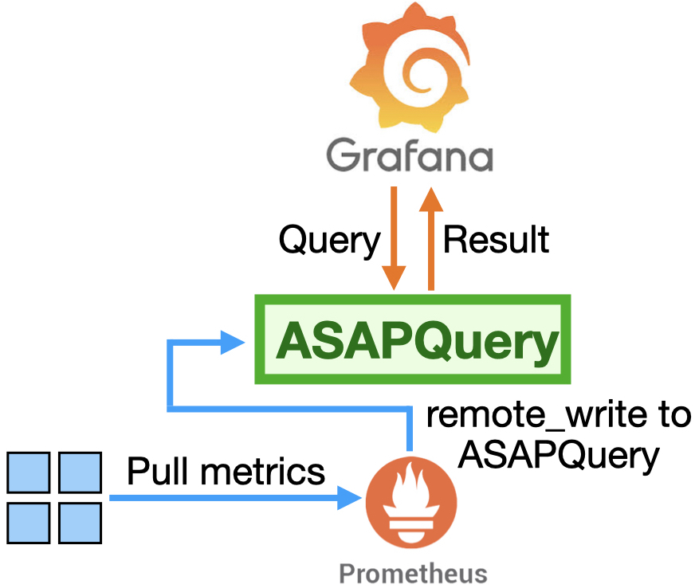

[](https://opensource.org/licenses/MIT)
[](https://github.com/ProjectASAP/ASAPQuery/actions/workflows/rust.yml)

# ASAPQuery

**ASAPQuery** is a drop-in query accelerator for queries in various languages like PromQL and SQL. ASAPQuery delivers:
- 100x latency reduction for various complex aggregate queries such as quantiles
- Lower CPU and memory usage during querying
- Ease-of-use with your existing tech stack

The current version of ASAPQuery works with a Prometheus-Grafana stack. We are extending it to work seamlessly with a Clickhouse-Grafana stack.



ASAPQuery sits between Prometheus and Grafana. It intercepts queries from Grafana and answers them using streaming sketches, instead of scanning large volumes of raw data in Prometheus.
It ingests data using Prometheus' remote_write interface.
ASAPQuery also targets other observability systems (e.g. VictoriaMetrics) and time-series databases (e.g. Clickhouse, Elastic).

## Try ASAPQuery with our self-contained demo

Try ASAPQuery in 5 minutes with our self-contained demo:

```bash
cd asap-quickstart
docker compose up -d
```

Open http://localhost:3000 and see ASAPQuery vs Prometheus side-by-side!

Full quickstart instructions at [**Quickstart Guide**](asap-quickstart/README.md)

If you already have Prometheus and Grafana running, follow the instruction below for asap-dropin

## Try ASAPQuery with your Prometheus-Grafana stack

```bash
cd asap-dropin
# Edit .env to point at your Prometheus, then:
docker compose up -d
```

Full drop-in instructions at [**Drop-in Guide**](asap-dropin/README.md)

## Supported Queries

ASAPQuery accelerates PromQL queries that match the following patterns. Queries that don't match are transparently forwarded to Prometheus.

**Temporal range functions** (no label selectors):
- `rate(metric[range])`
- `increase(metric[range])`
- `sum_over_time(metric[range])`, `count_over_time(metric[range])`, `avg_over_time(metric[range])`, `min_over_time(metric[range])`, `max_over_time(metric[range])`
- `quantile_over_time(φ, metric[range])`

**Aggregation operators** (with optional `by (label, ...)` clause, no label selectors):
- `sum(...)`, `count(...)`, `avg(...)`, `min(...)`, `max(...)`, `quantile(φ, ...)`, `topk(k, ...)`

**Binary arithmetic** — arithmetic combinations of the above patterns:
- e.g. `rate(errors_total[5m]) / rate(requests_total[5m])`

## Why ASAPQuery?

### The Problem

Prometheus (and most time-series analytics) struggle with:
- High-cardinality metrics that slow down queries
- Complex aggregations such as percentiles
- Long time windows - `quantile_over_time(...[1h])` can take seconds or fail
- Memory pressure - Loading all raw timeseries required for query computation

### The Solution

ASAPQuery uses streaming sketches to:
1. Pre-compute approximate summaries as data arrives
2. Answer queries in milliseconds using compact sketches instead of raw data
3. Bound memory usage - sketches are fixed-size regardless of data volume

## Architecture

ASAPQuery has two main components: **asap-planner-rs** analyzes your PromQL query workload and generates sketch configurations, and **asap-query-engine** intercepts PromQL queries and serves them from pre-computed sketches. The query engine includes a built-in streaming engine that continuously builds sketches directly from live metrics via Prometheus `remote_write`.

### Components

- **[asap-planner-rs](asap-planner-rs/)** - Analyzes a PromQL query workload and auto-generates sketch configurations for asap-query-engine
- **[asap-query-engine](asap-query-engine/)** - Intercepts incoming PromQL queries and serves them from pre-computed sketches, falling back to Prometheus for unsupported queries; includes a built-in precompute engine that continuously builds sketches from live metrics via Prometheus `remote_write`

## Coming soon

1. Drop-in ASAPQuery artifact that accelerates Clickhouse queries

## Current state

ASAPQuery is currently alpha. There are missing features, known bugs, and possible performance issues. We will continue to work on these and create a more mature artifact.

## Known limitations

- Only supports a single Grafana dashboard at a time, configured to auto-refresh at a fixed interval
- ASAPQuery ingests data via Prometheus `remote_write`, so the rightmost timestamps in Grafana may show no data even when data exists in Prometheus (data hasn't been ingested into ASAPQuery yet).

## Research

ASAPQuery is part of [ProjectASAP](https://projectasap.github.io/), a joint effort by researchers at Carnegie Mellon University and University of Maryland.
ASAPQuery is based on academic research on query processing and sketching algorithms.
If you are a researcher interested in using or contributing to ASAPQuery, please [contact us](README.md#contact-us). We are happy to help you.

## License

ASAPQuery is licensed under the MIT License.

## Acknowledgments

We are extremely grateful to the following sources of funding support for ASAPQuery and the academic research that underpins it:
- Laude Institute's Slingshot grant
- Juniper Networks
- U.S. NSF grants CNS-2431093, CNS-2415758, CNS-2132639, CNS-2111751, and CNS-2106214
- U.S. Army Research Office and U.S. Army Research Laboratory Grant W911NF-25-2-0028

## Contact us

Open a Github issue or email us at [contact@projectasap.dev](mailto:contact@projectasap.dev)
