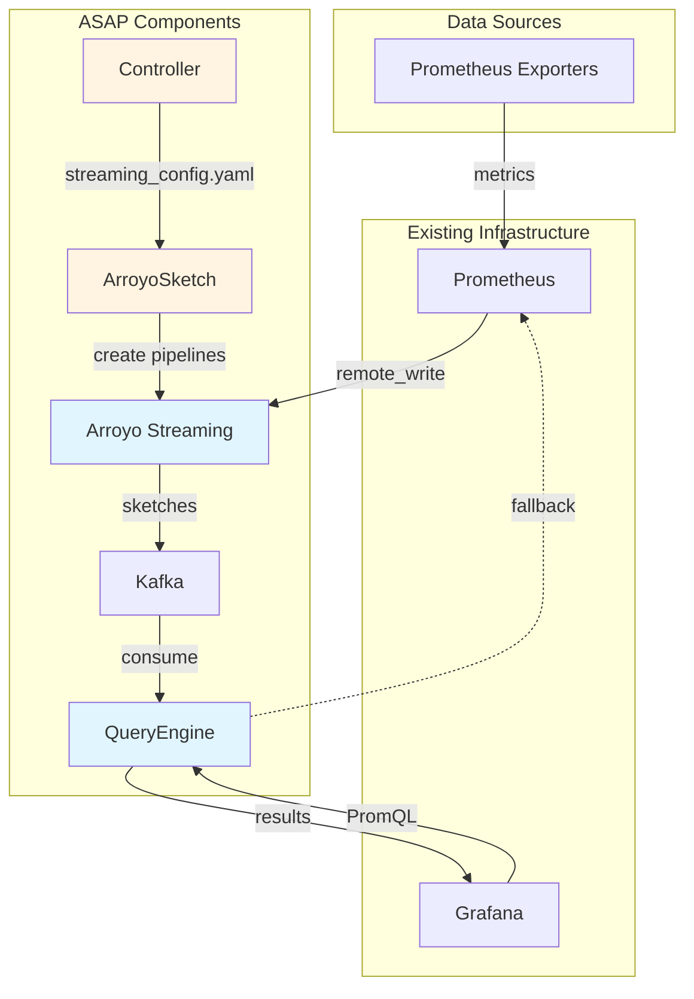
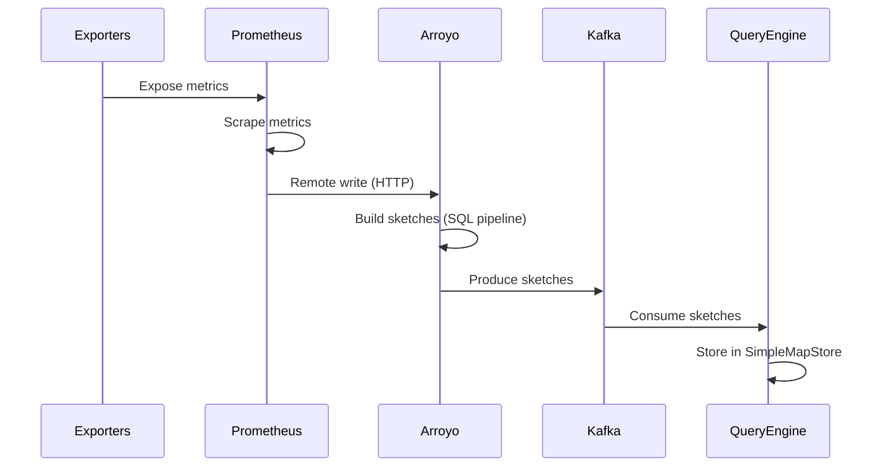
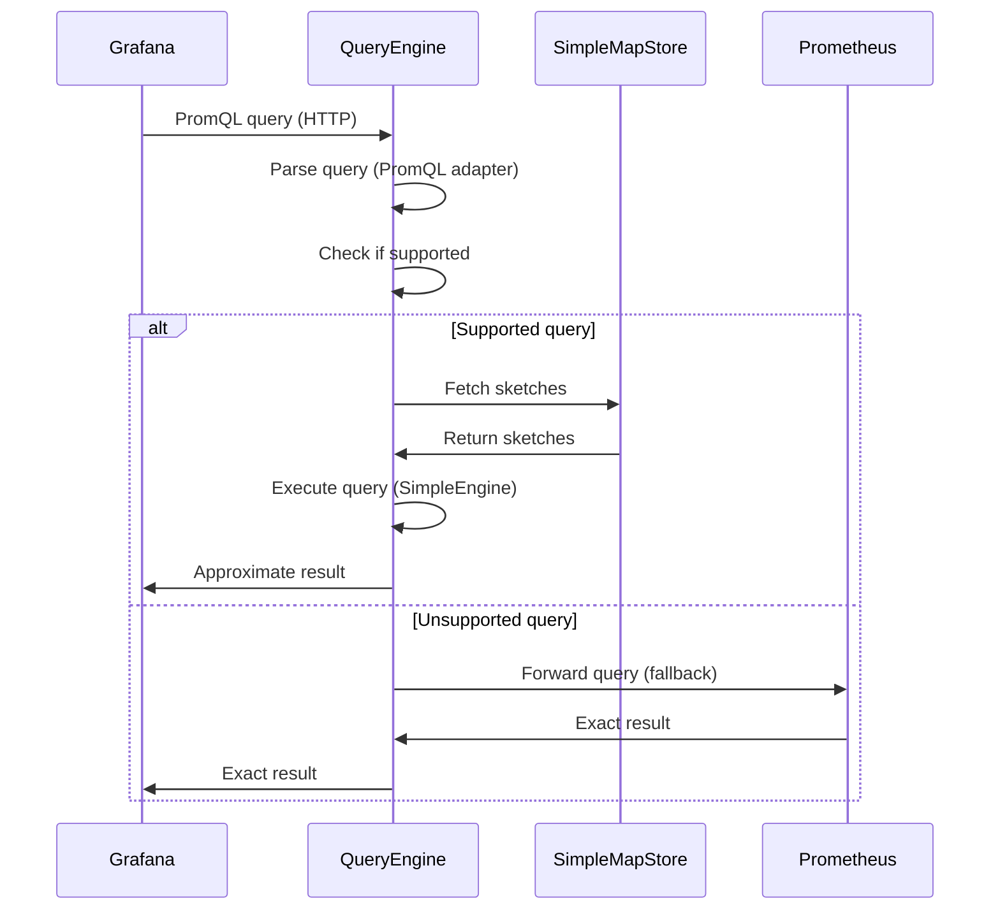
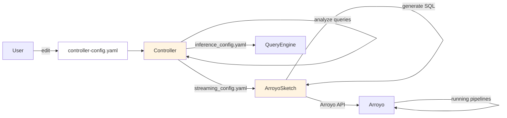

# Architecture

This document provides a comprehensive overview of ASAP's architecture, data flows, and design decisions.

## Table of Contents
- [High-Level Architecture](#high-level-architecture)
- [Data Flows](#data-flows)
- [Component Overview](#component-overview)
- [Key Design Decisions](#key-design-decisions)
- [Technology Stack](#technology-stack)
- [Repository Structure](#repository-structure)

## High-Level Architecture

ASAP consists of six main components working together to accelerate Prometheus queries:



## Data Flows

ASAP has three primary data flows: **Ingestion**, **Query Execution**, and **Configuration**.

### Ingestion Path

How metrics flow from exporters to sketches:



**Step-by-step:**

1. **Exporters** expose metrics on HTTP endpoints (e.g., `:9100/metrics`)
2. **Prometheus** scrapes metrics at a specified time interval (e.g. every 10s)
3. **Prometheus** sends metrics to **Arroyo** via remote write API
4. **Arroyo** receives raw metrics via custom connector (`prometheus_remote_write_optimized`)
5. **Arroyo** executes SQL pipelines that build sketches in real-time (configured by **ArroyoSketch**)
6. **Arroyo** produces sketches to **Kafka** output topic
7. **QueryEngine** consumes sketches from **Kafka**
8. **QueryEngine** stores sketches in **SimpleMapStore** (in-memory)

**Data format transformations:**
- **Exporter → Prometheus**: Prometheus exposition format (text)
- **Prometheus → Arroyo**: Prometheus remote write protobuf
- **Arroyo → Kafka**: Serialized sketches (custom format)
- **Kafka → QueryEngine**: Deserialize to custom sketch objects

### Query Path

How queries are executed:



**Step-by-step:**

1. **Grafana** sends PromQL query to **QueryEngine** (port 8088)
2. **PrometheusHttpAdapter** parses the HTTP request and extracts the query
3. **SimpleEngine** checks if the query can be answered with sketches
4. **If supported:**
   - Fetch relevant sketches from **SimpleMapStore**
   - Execute query using sketch operations
   - Format result as Prometheus-compatible JSON
5. **If unsupported:**
   - Forward query to **Prometheus** via fallback client
   - Return exact result from Prometheus
6. **QueryEngine** returns result to **Grafana**

**Query support examples:**
- ✅ Supported: `quantile(0.99, http_request_duration)`, `sum(rate(...))`
- ❌ Unsupported: `up == 1`, `label_replace(...)`, exact histograms

### Configuration Path

How sketches are configured:



**Step-by-step:**

1. **User** creates `controller-config.yaml` with:
   - List of queries to accelerate
   - Metric metadata (labels, types)

2. **Controller** analyzes the query workload:
   - Determines which sketch algorithms to use (DDSketch, KLL, etc.)
   - Computes sketch parameters (size, accuracy)
   - Generates `streaming_config.yaml` for Arroyo
   - Generates `inference_config.yaml` for QueryEngine

3. **ArroyoSketch** reads `streaming_config.yaml`:
   - Renders SQL templates using Jinja2
   - Creates Arroyo pipelines via REST API
   - Configures sketch UDFs with parameters

4. **QueryEngine** reads `inference_config.yaml`:
   - Knows which sketches to expect from Kafka
   - Configures deserialization logic
   - Sets up query routing

## Component Overview

| Component | Purpose | Technology | Location |
|-----------|---------|------------|----------|
| **QueryEngineRust** | Answers PromQL queries using sketches | Rust | `QueryEngineRust/` |
| **Arroyo** | Stream processing for building sketches | Rust (forked) | `arroyo/` |
| **ArroyoSketch** | Configures Arroyo pipelines from config | Python | `ArroyoSketch/` |
| **Controller** | Auto-determines sketch parameters | Python | `Controller/` |
| **Kafka** | Message broker for sketch distribution | Apache Kafka | (external) |
| **Prometheus** | Time-series database (existing) | Go | (external) |
| **Exporters** | Generate synthetic metrics for testing | Rust/Python | `PrometheusExporters/` |
| **Utilities** | Experimental harness that uses Cloudlab | Python | `Utilities/` |

**Links to detailed documentation:**
- [QueryEngineRust](../02-components/query-engine.md)
- [Arroyo](../02-components/arroyo.md)
- [ArroyoSketch](../02-components/arroyosketch.md)
- [Controller](../02-components/controller.md)
- [Exporters](../02-components/exporters.md)
- [Utilities](../02-components/utilities.md)

## Key Design Decisions

### Fallback Mechanism

**Design decision**: Always support fallback to Prometheus

**Rationale**:
- Not all queries can be accelerated (e.g., label manipulation)
- Users shouldn't have to know which queries are supported
- Gradual adoption - users can try ASAP without changing queries

**Implementation**:
- QueryEngine detects unsupported queries during parsing
- Forwards to Prometheus via HTTP client
- Returns results transparently

**Trade-off**: Added complexity vs. compatibility
- **Benefit outweighs cost**: Users can point Grafana at ASAP without modifying dashboards

## Technology Stack

### Core Languages
- **Rust** - QueryEngine, Arroyo, some exporters
  - Tokio for async runtime
  - Axum for HTTP server
  - Serde for serialization
  - DataSketches (dsrs) for sketch algorithms

- **Python** - Controller, ArroyoSketch, experiment framework
  - PyYAML for config parsing
  - Jinja2 for SQL templates
  - Requests for HTTP clients
  - Hydra for experiment config composition

### Infrastructure
- **Apache Kafka** - Message broker (KRaft mode, no Zookeeper)
- **Prometheus** - Time-series database
- **Grafana** - Visualization (unchanged from user's existing setup)

### Development Tools
- **Cargo** - Rust build system
- **Docker** - Containerization
- **GitHub Actions** - CI/CD
- **Pre-commit** - Git hooks for linting

## Repository Structure

```
asap-internal/
├── QueryEngineRust/          # Rust query processor
│   ├── src/
│   │   ├── drivers/          # Ingest, query adapters, servers
│   │   ├── engines/          # Query execution (SimpleEngine)
│   │   ├── stores/           # Data storage (SimpleMapStore)
│   │   ├── data_model/       # Core data structures
│   │   ├── precompute_operators/  # Sketch operators
│   │   └── tests/            # Integration tests
│   └── docs/                 # QueryEngine dev docs
│
├── arroyo/                   # Arroyo streaming engine (forked)
│   └── crates/
│       └── arroyo-connectors/
│           ├── prometheus_remote_write_with_schema/
│           └── prometheus_remote_write_optimized/
│
├── ArroyoSketch/             # Pipeline configurator
│   ├── run_arroyosketch.py   # Main script
│   ├── templates/            # Jinja2 SQL templates
│   └── utils/                # Arroyo API client
│
├── Controller/               # Auto-configuration service
│   ├── main_controller.py    # Entry point
│   ├── classes/              # Config data structures
│   └── utils/                # Decision logic
│
├── PrometheusExporters/      # Metric generators
│   ├── fake_exporter/        # Rust/Python fake exporters
│   ├── cluster_data_exporter/  # Real trace data
│   ├── query_cost_exporter/  # Resource metrics
│   └── query_latency_exporter/  # Latency metrics
│
├── Utilities/                # Experiment framework
│   ├── experiments/
│   │   ├── experiment_run_e2e.py  # Main orchestrator
│   │   ├── config/           # Hydra configs
│   │   ├── experiment_utils/ # Services, providers
│   │   └── post_experiment/  # Analysis scripts
│   └── docs/                 # Utilities dev docs
│
├── CommonDependencies/       # Shared libraries
│   ├── promql_utilities/     # PromQL parsing (Rust/Python)
│   └── sql_utilities/        # SQL utilities
│
├── quickstart/               # Self-contained demo
│   ├── docker-compose.yml    # Demo stack
│   └── config/               # Demo configs
│
└── docs/                     # Developer documentation (this)
    ├── 01-getting-started/
    ├── 02-components/
    ├── 03-how-to-guides/
    └── 04-development/
```
