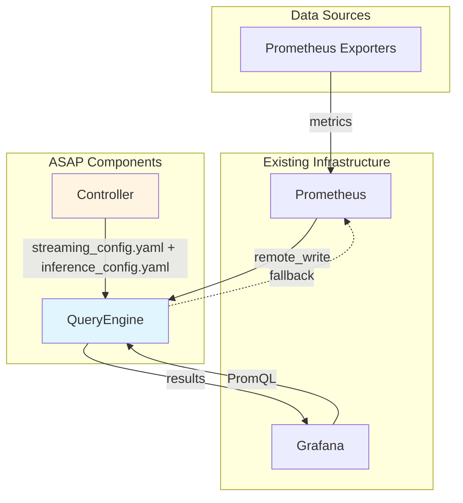
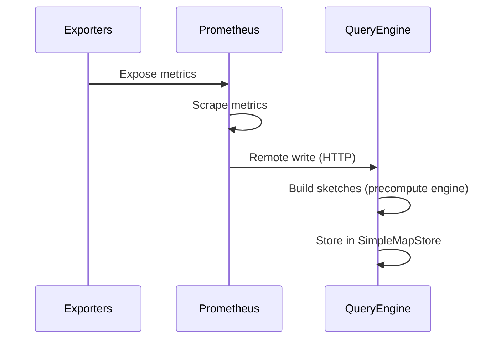
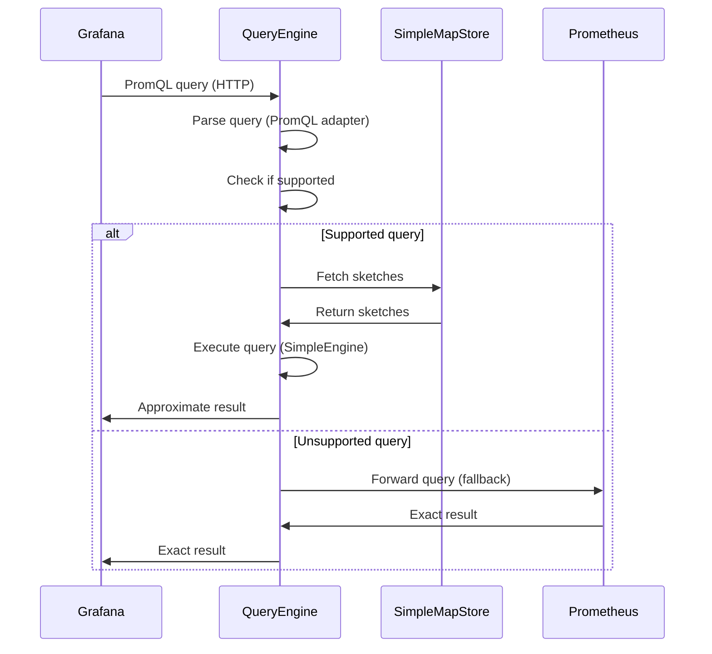
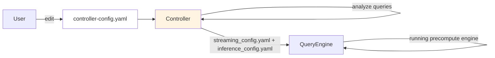

# Architecture

This document provides a comprehensive overview of ASAP's architecture, data flows, and design decisions.

## Table of Contents
- [High-Level Architecture](#high-level-architecture)
- [Data Flows](#data-flows)
- [Component Overview](#component-overview)
- [Key Design Decisions](#key-design-decisions)
- [Technology Stack](#technology-stack)
- [Repository Structure](#repository-structure)

## High-Level Architecture

ASAP consists of four main components working together to accelerate Prometheus queries:


```mermaid
graph TB
    subgraph "Data Sources"
        E[Prometheus Exporters]
    end

    subgraph "Existing Infrastructure"
        P[Prometheus]
        G[Grafana]
    end

    subgraph "ASAP Components"
        Q[QueryEngine]
        C[Controller]
    end

    E -->|metrics| P
    P -->|remote_write| Q
    G -->|PromQL| Q
    Q -->|results| G
    Q -.->|fallback| P

    C -->|streaming_config.yaml + inference_config.yaml| Q

    style Q fill:#e1f5ff
    style C fill:#fff4e1
```

## Data Flows

ASAP has three primary data flows: **Ingestion**, **Query Execution**, and **Configuration**.

### Ingestion Path

How metrics flow from exporters to sketches:


```mermaid
sequenceDiagram
    participant E as Exporters
    participant P as Prometheus
    participant Q as QueryEngine

    E->>P: Expose metrics
    P->>P: Scrape metrics
    P->>Q: Remote write (HTTP)
    Q->>Q: Build sketches (precompute engine)
    Q->>Q: Store in SimpleMapStore
```

**Step-by-step:**

1. **Exporters** expose metrics on HTTP endpoints (e.g., `:9100/metrics`)
2. **Prometheus** scrapes metrics at a specified time interval (e.g. every 10s)
3. **Prometheus** sends metrics to **QueryEngine** via remote write API
4. **QueryEngine**'s precompute engine builds sketches in real-time (configured by **Controller**)
5. **QueryEngine** stores sketches in **SimpleMapStore** (in-memory)

**Data format transformations:**
- **Exporter → Prometheus**: Prometheus exposition format (text)
- **Prometheus → QueryEngine**: Prometheus remote write protobuf

### Query Path

How queries are executed:


```mermaid
sequenceDiagram
    participant G as Grafana
    participant Q as QueryEngine
    participant S as SimpleMapStore
    participant P as Prometheus

    G->>Q: PromQL query (HTTP)
    Q->>Q: Parse query (PromQL adapter)
    Q->>Q: Check if supported

    alt Supported query
        Q->>S: Fetch sketches
        S->>Q: Return sketches
        Q->>Q: Execute query (SimpleEngine)
        Q->>G: Approximate result
    else Unsupported query
        Q->>P: Forward query (fallback)
        P->>Q: Exact result
        Q->>G: Exact result
    end
```

**Step-by-step:**

1. **Grafana** sends PromQL query to **QueryEngine** (port 8088)
2. **PrometheusHttpAdapter** parses the HTTP request and extracts the query
3. **SimpleEngine** checks if the query can be answered with sketches
4. **If supported:**
   - Fetch relevant sketches from **SimpleMapStore**
   - Execute query using sketch operations
   - Format result as Prometheus-compatible JSON
5. **If unsupported:**
   - Forward query to **Prometheus** via fallback client
   - Return exact result from Prometheus
6. **QueryEngine** returns result to **Grafana**

**Query support examples:**
- ✅ Supported: `quantile(0.99, http_request_duration)`, `sum(rate(...))`
- ❌ Unsupported: `up == 1`, `label_replace(...)`, exact histograms

### Configuration Path

How sketches are configured:


```mermaid
graph LR
    U[User] -->|edit| CC[controller-config.yaml]
    CC --> C[Controller]
    C -->|analyze queries| C
    C -->|streaming_config.yaml + inference_config.yaml| Q[QueryEngine]
    Q -->|running precompute engine| Q

    style CC fill:#fff
    style C fill:#fff4e1
```

**Step-by-step:**

1. **User** creates `controller-config.yaml` with:
   - List of queries to accelerate
   - Metric metadata (labels, types)

2. **Controller** analyzes the query workload:
   - Determines which sketch algorithms to use (DDSketch, KLL, etc.)
   - Computes sketch parameters (size, accuracy)
   - Generates `streaming_config.yaml` and `inference_config.yaml` for QueryEngine

3. **QueryEngine** reads `streaming_config.yaml` and `inference_config.yaml`:
   - Configures the precompute engine's sketch-building for incoming remote write samples
   - Sets up query routing

## Component Overview

| Component | Purpose | Technology | Location |
|-----------|---------|------------|----------|
| **asap-query-engine** | Receives Prometheus remote write, builds sketches (precompute engine), and answers PromQL queries using them | Rust | `asap-query-engine/` |
| **asap-planner-rs** | Auto-determines sketch parameters | Rust | `asap-planner-rs/` |
| **Prometheus** | Time-series database (existing) | Go | (external) |
| **Exporters** | Generate synthetic metrics for testing | Rust/Python | `asap-tools/data-sources/prometheus-exporters/` |
| **asap-tools** | Experimental harness that uses Cloudlab | Python | `asap-tools/` |

**Links to detailed documentation:**
- [QueryEngineRust](../02-components/query-engine.md)
- [Controller](../02-components/controller.md)
- [Exporters](../02-components/exporters.md)
- [Utilities](../02-components/utilities.md)

## Key Design Decisions

### Fallback Mechanism

**Design decision**: Always support fallback to Prometheus

**Rationale**:
- Not all queries can be accelerated (e.g., label manipulation)
- Users shouldn't have to know which queries are supported
- Gradual adoption - users can try ASAP without changing queries

**Implementation**:
- QueryEngine detects unsupported queries during parsing
- Forwards to Prometheus via HTTP client
- Returns results transparently

**Trade-off**: Added complexity vs. compatibility
- **Benefit outweighs cost**: Users can point Grafana at ASAP without modifying dashboards

## Technology Stack

### Core Languages
- **Rust** - asap-query-engine, asap-planner-rs, some exporters
  - Tokio for async runtime
  - Axum for HTTP server
  - Serde for serialization
  - DataSketches (dsrs) for sketch algorithms

- **Python** - experiment framework
  - PyYAML for config parsing
  - Requests for HTTP clients
  - Hydra for experiment config composition

### Infrastructure
- **Prometheus** - Time-series database
- **Grafana** - Visualization (unchanged from user's existing setup)

### Development Tools
- **Cargo** - Rust build system
- **Docker** - Containerization
- **GitHub Actions** - CI/CD
- **Pre-commit** - Git hooks for linting

## Repository Structure

```
ASAPQuery/
├── asap-query-engine/        # Rust query processor
│   ├── src/
│   │   ├── drivers/          # Ingest, query adapters, servers
│   │   ├── engines/          # Query execution (SimpleEngine)
│   │   ├── stores/           # Data storage (SimpleMapStore)
│   │   ├── data_model/       # Core data structures
│   │   ├── precompute_operators/  # Sketch operators
│   │   └── tests/            # Integration tests
│   └── docs/                 # QueryEngine dev docs
│
├── asap-planner-rs/          # Auto-configuration service
│   ├── main_controller.py    # Entry point
│   ├── classes/              # Config data structures
│   └── utils/                # Decision logic
│
├── asap-tools/               # Experiment framework & tooling
│   ├── data-sources/
│   │   └── prometheus-exporters/ # Metric generators
│   │       ├── fake_exporter/        # Rust/Python fake exporters
│   │       ├── cluster_data_exporter/  # Real trace data
│   │       ├── query_cost_exporter/  # Resource metrics
│   │       └── query_latency_exporter/  # Latency metrics
│   ├── queriers/
│   │   └── prometheus-client/    # PromQL query client
│   ├── experiments/
│   │   ├── experiment_run_e2e.py  # Main orchestrator
│   │   ├── config/           # Hydra configs
│   │   ├── experiment_utils/ # Services, providers
│   │   └── post_experiment/  # Analysis scripts
│   └── docs/                 # asap-tools dev docs
│
├── asap-common/              # Shared libraries
│   ├── dependencies/
│   │   ├── rs/               # Rust shared crates
│   │   └── py/               # Python shared packages
│   └── sketch-core/          # Core sketch library (Rust)
│
├── asap-quickstart/          # Self-contained demo
│   ├── docker-compose.yml    # Demo stack
│   └── config/               # Demo configs
│
└── docs/                     # Developer documentation (this)
    ├── 01-getting-started/
    ├── 02-components/
    ├── 03-how-to-guides/
    └── 04-development/
```
