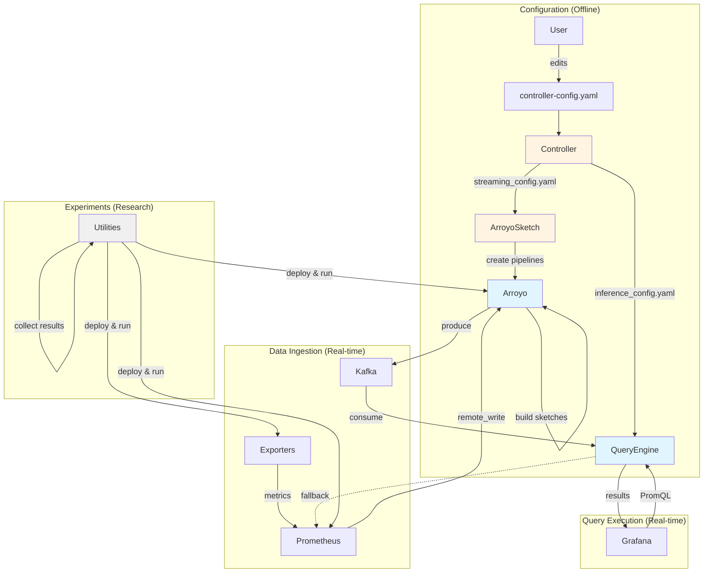

# Component Index

This document provides an overview of all ASAP components and links to detailed documentation.

## Components at a Glance

| Component | Purpose | Technology | Links |
|-----------|---------|------------|-------|
| **QueryEngineRust** | Answers PromQL queries using sketches | Rust | [Details](query-engine.md) · [Code](../../QueryEngineRust/) · [Dev Docs](../../QueryEngineRust/docs/README.md) |
| **Arroyo** | Stream processing for building sketches | Rust (forked) | [Details](arroyo.md) · [Code](../../arroyo/) |
| **ArroyoSketch** | Configures Arroyo pipelines from config | Python | [Details](arroyosketch.md) · [Code](../../ArroyoSketch/) · [README](../../ArroyoSketch/README.md) |
| **Controller** | Auto-determines sketch parameters | Python | [Details](controller.md) · [Code](../../Controller/) · [README](../../Controller/README.md) |
| **Exporters** | Generate synthetic metrics for testing | Rust/Python | [Details](exporters.md) · [Code](../../PrometheusExporters/) · [README](../../PrometheusExporters/README.md) |
| **Utilities** | Experiment framework for CloudLab | Python | [Details](utilities.md) · [Code](../../Utilities/) · [Docs](../../Utilities/docs/architecture.md) |

## Component Interaction



## By Role

### Core Runtime Components

These run continuously to serve queries:

- **[QueryEngineRust](query-engine.md)** - Answers PromQL queries using sketches
  - Consumes sketches from Kafka
  - Implements Prometheus HTTP API
  - Forwards unsupported queries to Prometheus

- **[Arroyo](arroyo.md)** - Builds sketches from metrics streams
  - Receives Prometheus remote write
  - Executes SQL pipelines
  - Produces sketches to Kafka

### Configuration Components

These run once to set up the system:

- **[Controller](controller.md)** - Determines optimal sketch parameters
  - Analyzes query workload
  - Selects sketch algorithms
  - Generates configs for Arroyo and QueryEngine

- **[ArroyoSketch](arroyosketch.md)** - Creates Arroyo pipelines
  - Reads streaming_config.yaml
  - Renders SQL templates
  - Creates pipelines via Arroyo API

### Testing & Research Components

These are used for development and experiments:

- **[Exporters](exporters.md)** - Generate synthetic metrics
  - Fake exporters with configurable cardinality
  - Real trace data exporters
  - Performance monitoring exporters

- **[Utilities](utilities.md)** - Experiment orchestration
  - Deploy ASAP to CloudLab
  - Run controlled experiments
  - Collect and analyze results

## By Language

### Rust Components

Performance-critical components written in Rust:

- **QueryEngineRust** - Sub-millisecond query execution
- **Arroyo** - High-throughput stream processing
- **Fake Exporters** - Fast metric generation

### Python Components

Configuration and orchestration in Python:

- **Controller** - Query analysis and config generation
- **ArroyoSketch** - Pipeline configuration
- **Utilities** - Experiment framework
- **Python Exporters** - Simpler metric generators

## Component Dependencies

```
QueryEngineRust
├── Kafka (runtime) - Consumes sketches
├── Prometheus (runtime, optional) - Fallback queries
└── inference_config.yaml (config) - From Controller

Arroyo
├── Prometheus (runtime) - Remote write source
├── Kafka (runtime) - Sketch output
└── SQL pipelines (config) - From ArroyoSketch

ArroyoSketch
├── Arroyo (runtime) - Creates pipelines via API
└── streaming_config.yaml (config) - From Controller

Controller
├── controller-config.yaml (input) - User-provided
├── streaming_config.yaml (output) - For ArroyoSketch
└── inference_config.yaml (output) - For QueryEngine

Exporters
└── (standalone, no dependencies)

Utilities
├── All components (deploys and orchestrates)
└── Hydra configs (experiment specifications)
```

## Component Documentation

### Detailed Component Docs

- [QueryEngineRust](query-engine.md) - Query processor deep dive
- [Arroyo](arroyo.md) - Streaming engine + ASAP customizations
- [ArroyoSketch](arroyosketch.md) - Pipeline configurator
- [Controller](controller.md) - Auto-configuration service
- [Exporters](exporters.md) - Metric generators
- [Utilities](utilities.md) - Experiment framework

### Component-Specific READMEs

For implementation details, see READMEs co-located with code:

- [QueryEngineRust/docs/](../../QueryEngineRust/docs/README.md) - Extensibility guides
- [Controller/README.md](../../Controller/README.md) - Controller internals
- [ArroyoSketch/README.md](../../ArroyoSketch/README.md) - Pipeline config internals
- [PrometheusExporters/README.md](../../PrometheusExporters/README.md) - Exporter implementations
- [Utilities/docs/](../../Utilities/docs/architecture.md) - Experiment framework architecture
