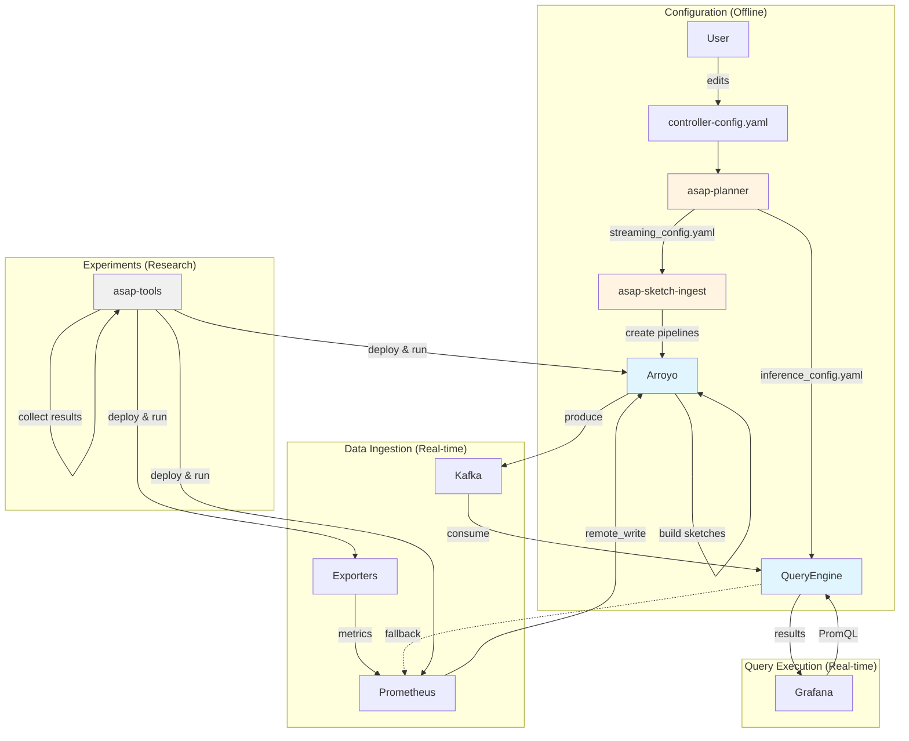

# Component Index

This document provides an overview of all ASAP components and links to detailed documentation.

## Components at a Glance

| Component | Purpose | Technology | Links |
|-----------|---------|------------|-------|
| **asap-query-engine** | Answers PromQL queries using sketches | Rust | [Details](query-engine.md) · [Code](../../asap-query-engine/) · [Dev Docs](../../asap-query-engine/docs/README.md) |
| **Arroyo** | Stream processing for building sketches | Rust (forked) | [Details](arroyo.md) · [Code](https://github.com/ProjectASAP/arroyo) |
| **asap-sketch-ingest** | Configures Arroyo pipelines from config | Python | [Details](arroyosketch.md) · [Code](../../asap-sketch-ingest/) · [README](../../asap-sketch-ingest/README.md) |
| **asap-planner** | Auto-determines sketch parameters | Python | [Details](controller.md) · [Code](../../asap-planner/) · [README](../../asap-planner/README.md) |
| **Exporters** | Generate synthetic metrics for testing | Rust/Python | [Details](exporters.md) · [Code](../../asap-tools/prometheus-exporters/) · [README](../../asap-tools/prometheus-exporters/README.md) |
| **asap-tools** | Experiment framework for CloudLab | Python | [Details](utilities.md) · [Code](../../asap-tools/) · [Docs](../../asap-tools/docs/architecture.md) |

## Component Interaction



## By Role

### Core Runtime Components

These run continuously to serve queries:

- **[asap-query-engine](query-engine.md)** - Answers PromQL queries using sketches
  - Consumes sketches from Kafka
  - Implements Prometheus HTTP API
  - Forwards unsupported queries to Prometheus

- **[Arroyo](arroyo.md)** - Builds sketches from metrics streams
  - Receives Prometheus remote write
  - Executes SQL pipelines
  - Produces sketches to Kafka

### Configuration Components

These run once to set up the system:

- **[asap-planner](controller.md)** - Determines optimal sketch parameters
  - Analyzes query workload
  - Selects sketch algorithms
  - Generates configs for Arroyo and QueryEngine

- **[asap-sketch-ingest](arroyosketch.md)** - Creates Arroyo pipelines
  - Reads streaming_config.yaml
  - Renders SQL templates
  - Creates pipelines via Arroyo API

### Testing & Research Components

These are used for development and experiments:

- **[Exporters](exporters.md)** - Generate synthetic metrics
  - Fake exporters with configurable cardinality
  - Real trace data exporters
  - Performance monitoring exporters

- **[asap-tools](utilities.md)** - Experiment orchestration
  - Deploy ASAP to CloudLab
  - Run controlled experiments
  - Collect and analyze results

## By Language

### Rust Components

Performance-critical components written in Rust:

- **asap-query-engine** - Sub-millisecond query execution
- **Arroyo** - High-throughput stream processing
- **Fake Exporters** - Fast metric generation

### Python Components

Configuration and orchestration in Python:

- **asap-planner** - Query analysis and config generation
- **asap-sketch-ingest** - Pipeline configuration
- **asap-tools** - Experiment framework
- **Python Exporters** - Simpler metric generators

## Component Dependencies

```
asap-query-engine
├── Kafka (runtime) - Consumes sketches
├── Prometheus (runtime, optional) - Fallback queries
└── inference_config.yaml (config) - From asap-planner

Arroyo
├── Prometheus (runtime) - Remote write source
├── Kafka (runtime) - Sketch output
└── SQL pipelines (config) - From asap-sketch-ingest

asap-sketch-ingest
├── Arroyo (runtime) - Creates pipelines via API
└── streaming_config.yaml (config) - From asap-planner

asap-planner
├── controller-config.yaml (input) - User-provided
├── streaming_config.yaml (output) - For asap-sketch-ingest
└── inference_config.yaml (output) - For asap-query-engine

Exporters
└── (standalone, no dependencies)

asap-tools
├── All components (deploys and orchestrates)
└── Hydra configs (experiment specifications)
```

## Component Documentation

### Detailed Component Docs

- [asap-query-engine](query-engine.md) - Query processor deep dive
- [Arroyo](arroyo.md) - Streaming engine + ASAP customizations
- [asap-sketch-ingest](arroyosketch.md) - Pipeline configurator
- [asap-planner](controller.md) - Auto-configuration service
- [Exporters](exporters.md) - Metric generators
- [asap-tools](utilities.md) - Experiment framework

### Component-Specific READMEs

For implementation details, see READMEs co-located with code:

- [asap-query-engine/docs/](../../asap-query-engine/docs/README.md) - Extensibility guides
- [asap-planner/README.md](../../asap-planner/README.md) - asap-planner internals
- [asap-sketch-ingest/README.md](../../asap-sketch-ingest/README.md) - Pipeline config internals
- [asap-tools/prometheus-exporters/README.md](../../asap-tools/prometheus-exporters/README.md) - Exporter implementations
- [asap-tools/docs/](../../asap-tools/docs/architecture.md) - Experiment framework architecture
