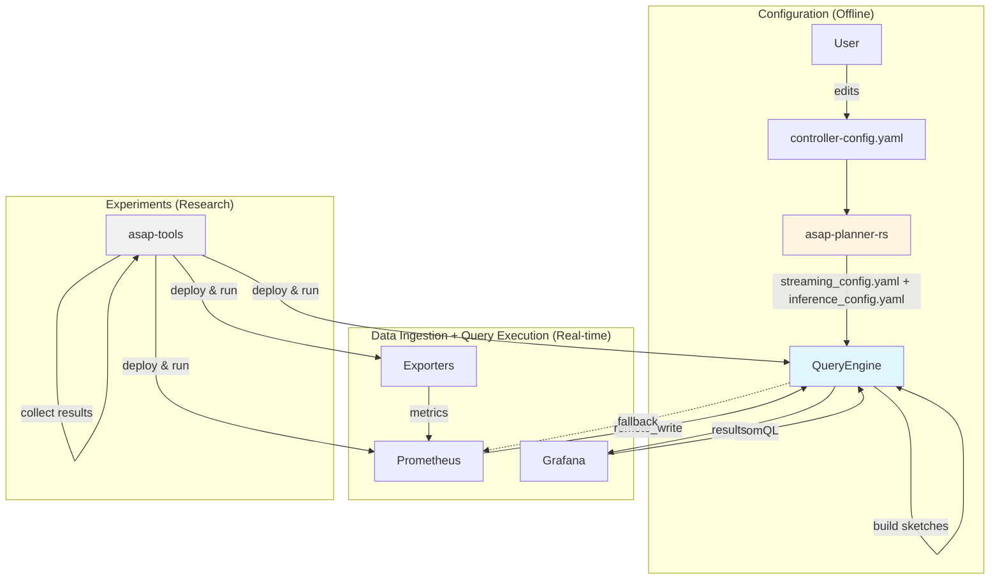

# Component Index

This document provides an overview of all ASAP components and links to detailed documentation.

## Components at a Glance

| Component | Purpose | Technology | Links |
|-----------|---------|------------|-------|
| **asap-query-engine** | Receives Prometheus remote write, builds sketches, and answers PromQL queries using them | Rust | [Details](query-engine.md) · [Code](../../asap-query-engine/) · [Dev Docs](../../asap-query-engine/docs/README.md) |
| **asap-planner-rs-rs** | Auto-determines sketch parameters | Rust | [Details](controller.md) · [Code](../../asap-planner-rs-rs/) |
| **Exporters** | Generate synthetic metrics for testing | Rust/Python | [Details](exporters.md) · [Code](../../asap-tools/data-sources/prometheus-exporters/) · [README](../../asap-tools/data-sources/prometheus-exporters/README.md) |
| **asap-tools** | Experiment framework for CloudLab | Python | [Details](utilities.md) · [Code](../../asap-tools/) · [Docs](../../asap-tools/docs/architecture.md) |

## Component Interaction


```mermaid
graph TB
    subgraph "Configuration (Offline)"
        U[User] -->|edits| CC[controller-config.yaml]
        CC --> C[asap-planner-rs]
        C -->|streaming_config.yaml + inference_config.yaml| Q
    end

    subgraph "Data Ingestion + Query Execution (Real-time)"
        E[Exporters] -->|metrics| P[Prometheus]
        P -->|remote_write| Q[QueryEngine]
        Q -->|build sketches| Q
        G[Grafana] -->|PromQL| Q
        Q -->|results| G
        Q -.->|fallback| P
    end

    subgraph "Experiments (Research)"
        EXP[asap-tools] -->|deploy & run| E
        EXP -->|deploy & run| P
        EXP -->|deploy & run| Q
        EXP -->|collect results| EXP
    end

    style C fill:#fff4e1
    style Q fill:#e1f5ff
    style EXP fill:#f0f0f0
```

## By Role

### Core Runtime Components

These run continuously to serve queries:

- **[asap-query-engine](query-engine.md)** - Answers PromQL queries using sketches
  - Receives Prometheus remote write directly (precompute engine)
  - Builds sketches in real-time
  - Implements Prometheus HTTP API
  - Forwards unsupported queries to Prometheus

### Configuration Components

These run once to set up the system:

- **[asap-planner-rs](controller.md)** - Determines optimal sketch parameters
  - Analyzes query workload
  - Selects sketch algorithms
  - Generates configs for QueryEngine

### Testing & Research Components

These are used for development and experiments:

- **[Exporters](exporters.md)** - Generate synthetic metrics
  - Fake exporters with configurable cardinality
  - Real trace data exporters
  - Performance monitoring exporters

- **[asap-tools](utilities.md)** - Experiment orchestration
  - Deploy ASAP to CloudLab
  - Run controlled experiments
  - Collect and analyze results

## By Language

### Rust Components

Performance-critical components written in Rust:

- **asap-query-engine** - Sub-millisecond query execution
- **Fake Exporters** - Fast metric generation

### Python Components

Configuration and orchestration in Python:

- **asap-planner-rs** - Query analysis and config generation
- **asap-tools** - Experiment framework
- **Python Exporters** - Simpler metric generators

## Component Dependencies

```
asap-query-engine
├── Prometheus (runtime) - Remote write source; optional fallback for unsupported queries
├── streaming_config.yaml (config) - From asap-planner-rs
└── inference_config.yaml (config) - From asap-planner-rs

asap-planner-rs
├── controller-config.yaml (input) - User-provided
├── streaming_config.yaml (output) - For asap-query-engine
└── inference_config.yaml (output) - For asap-query-engine

Exporters
└── (standalone, no dependencies)

asap-tools
├── All components (deploys and orchestrates)
└── Hydra configs (experiment specifications)
```

## Component Documentation

### Detailed Component Docs

- [asap-query-engine](query-engine.md) - Query processor deep dive
- [asap-planner-rs](controller.md) - Auto-configuration service
- [Exporters](exporters.md) - Metric generators
- [asap-tools](utilities.md) - Experiment framework

### Component-Specific READMEs

For implementation details, see READMEs co-located with code:

- [asap-query-engine/docs/](../../asap-query-engine/docs/README.md) - Extensibility guides
- [asap-planner-rs/README.md](../../asap-planner-rs/README.md) - asap-planner-rs internals
- [asap-tools/data-sources/prometheus-exporters/README.md](../../asap-tools/data-sources/prometheus-exporters/README.md) - Exporter implementations
- [asap-tools/docs/](../../asap-tools/docs/architecture.md) - Experiment framework architecture
